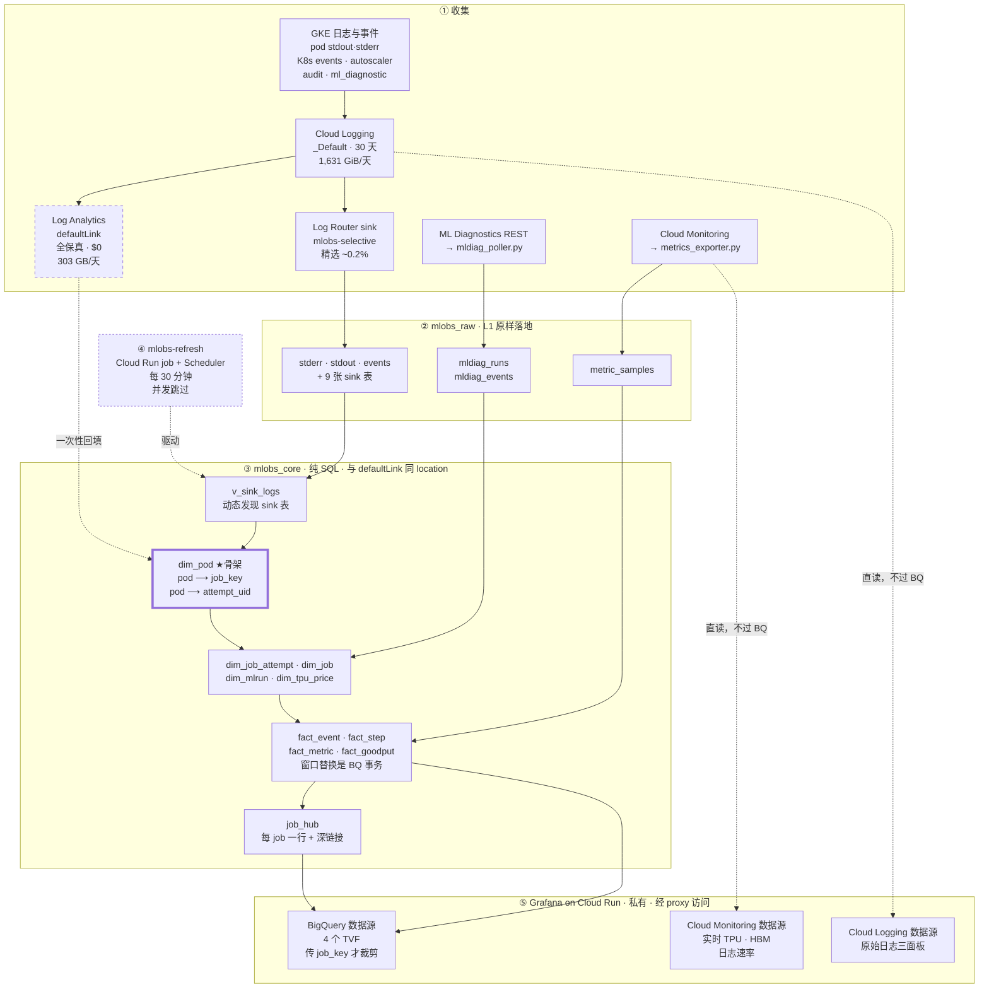
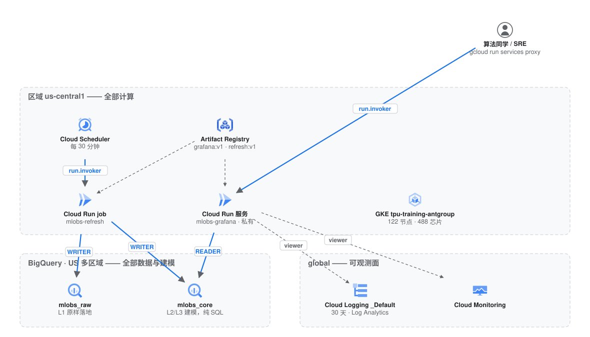
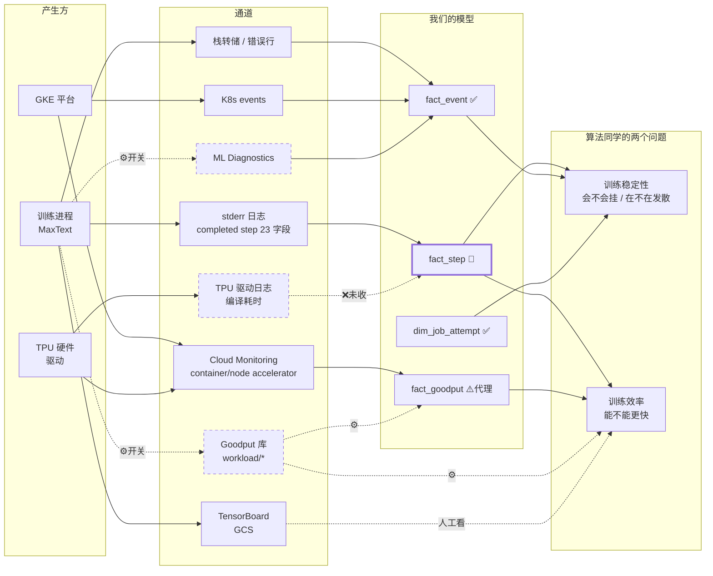

# ML 训练聚合监控与分析平台

面向 GKE 上 TPU 训练的聚合可观测平台。把散落在日志、指标、ML Diagnostics 里的信号
收敛成**以 job 为中心**的一份数据，回答三个现有工具答不了的问题：

1. **这个 job 为什么慢 / 卡 / 挂了？** —— 一条时间线，所有来源
2. **TPU 时间有多少是有效的？每个 job 花了多少钱？** —— Goodput 与成本
3. **我该看哪儿？** —— 每个 job 一个 URL

目标环境：`tpu-for-training`（生产）与 `tpu-launchpad-playground`（测试）。
同一份代码部署到两个项目。

> 文中数字都标了来源。**实测**＝对真实环境的直接测量；**估算**＝基于实测的推算。
> 价格来自 Cloud Billing Catalog API。

---

## 目录

1. [设计原则](#1-设计原则)
2. [环境实测底数](#2-环境实测底数)
3. [两个视角、两个使用者](#3-两个视角两个使用者)
4. [架构](#4-架构)
5. [当前状态](#5-当前状态)
6. [成本](#6-成本)
7. [待决策与进行中](#7-待决策与进行中)
8. [路线图](#8-路线图)
9. [运行方式](#9-运行方式)
10. [Caveats](#10-caveats)
11. [踩过的坑](#11-踩过的坑)

**两个附录，各自自包含（大全 + 地图）：**

- **[附录 A：日志](docs/logs.md)** —— 27 个日志渠道 + 4 个 API 渠道的完整清单、
  按意图导航、归属方式、每条渠道的路由决策（留 Cloud Logging 还是进 BigQuery）、待办
- **[附录 B：指标](docs/metrics.md)** —— 五个来源 × 两个视角、全量能力地图（167 个
  实测有数据）、goodput 算法拆解、新增指标的决策规则、要客户打开的开关

---

## 1. 设计原则

### 1.1 只依赖 GCP 与 Kubernetes 原生

信号只取自：容器日志、K8s 事件与对象、Cloud Monitoring 指标、ML Diagnostics API。
**不接入任何客户自建系统的私有接口或内部指标。**

`falcon-jobs` 的任务由 **kubemaker**（蚂蚁自建的类 Kubeflow 调度器）产出。平台只认它
产出的**标准 K8s 对象**——pod、Job、事件、label——不碰它的调度队列、状态机、
内部 API。原因是可移植性：换个客户或 kubemaker 改版，标准对象仍然在。

同一条原则决定了 `dim_pod` 的骨架是 **K8s 事件**而不是容器日志：事件是 Kubernetes
保证产生的，日志内容取决于业务代码怎么写。

### 1.2 价值在 join，不在画图

现状不是「没有监控」，而是**监控是碎的**：11 个 Dashboard、7 条告警、Cluster
Director、Logs Explorer 四个入口，彼此没有共同实体。平台的核心产出是**统一实体**
（job ↔ attempt ↔ pod ↔ node ↔ chip ↔ owner ↔ 成本），不是又一批图表。

### 1.3 先盘点，再开发

新增任何指标或图表之前，先查[能力地图](docs/metrics.md#45-全量能力地图167-个)。

代价实例：本平台用 tensorcore 利用率自建了 goodput 代理算法，而 GKE 本身就发布
`kubernetes.io/jobset/proxy_runtime_goodput`。

---

## 2. 环境实测底数

### 2.1 集群与工作负载

| 项 | 值 |
|---|---|
| 集群 | `tpu-training-antgroup`（143 节点，GKE 1.34.9）、`tpu-training-antgroup-v2`（8 节点），均 us-central1 **regional** |
| TPU 节点池 | 37 × `tpu7x-standard-4t`、2 × `ct5p-hightpu-4t`（v5p） |
| Log Analytics | `_Default` 已启用，linked dataset **`defaultLink` 已存在**（**US 多区域**） |
| GMP | 已开，`autoMonitoring scope=ALL`；DCGM + JOBSET + CADVISOR + KUBELET |
| 已有资产 | 11 个 Dashboard、7 条 Alert Policy、4 个 log-based metric |

**四个工作负载族并存**，实体建模必须同时覆盖：

| 族 | 命名空间 | Pod 命名 | K8s 类型 | 生产 job 数 |
|---|---|---|---|---|
| **falcon**（kubemaker 产出，当前主力） | `falcon-jobs` | `falcon-job-<id>-<idx>-<hash>` 或 `falcon-job-<id>-<hash>` | Job | **1,540** |
| JobSet / MaxText | `default` | `<jobset>-worker-<n>-…` | JobSet | 201 |
| 普通 Job | `default` 等 | 各异 | Job | 72 |
| Deployment / DaemonSet | 各处 | — | Deployment 等 | 19 |

pod label 里有现成的 join key：

```
logging.gke.io/top_level_controller_name        job 名（权威，覆盖率 100%）
k8s-pod/jobset_sigs_k8s_io/jobset-name          JobSet 名（JobSet 族用这个）
k8s-pod/batch_kubernetes_io/controller-uid      一次尝试的 UUID
k8s-pod/falcon_io/{job-id, exp-id, cluster-id}  falcon 的业务标识
k8s-pod/owner                                   成本归属
```

### 2.2 日志规模

来自 `logging.googleapis.com/billing/bytes_ingested`，14 天均值：

| 项 | 实测 |
|---|---|
| **计费摄入量** | **1,631 GiB/天**（`k8s_container` 占 99.6%） |
| 日志条数 | ~12.4 亿条/天 |
| **单条平均计费体积** | **~1.4 KB** —— 而 payload 只有 **273 B** |

> **80% 的日志账单是 labels/metadata，不是日志内容。** 按 payload 长度估算会低估 5 倍。

severity 分布（1 天）：`WARNING` **9.33 亿（75%）** · `INFO` 2.97 亿 ·
`ERROR` 238 万 · `DEFAULT`/`DEBUG` 343 万 · `CRITICAL` 24。

**信噪比**：falcon-jobs 6 小时内 6.24 亿条日志，含 `loss` 的 7,854 条 ——
训练指标信号占 **0.0013%**。

### 2.3 BigQuery 扫描成本剖面

这组数字决定了建模层怎么写。`defaultLink` 上**每天数据**的扫描量：

| 查询触及 | 扫描量 |
|---|---|
| 只读 `timestamp` | 9.9 GB |
| `+ severity` | 20 GB |
| `+ resource` | 174 GB |
| `+ json_payload` | 245 GB |
| **`+ labels`** | **303 GB** ← 最贵 |
| `log_id='events'` + labels | **10.5 GB** ✅ |
| `severity>=ERROR` + payload | **11.9 GB** ✅ |
| **精选 sink 上读同样的 labels** | **813 MB** ← 便宜 **373 倍** |

**只有 `log_id` 和 `severity` 能有效裁剪。** 建模层因此只读这两个可裁剪切片和
sink，从不扫全量 payload。

> 一个 job 到底能查到哪些日志渠道（实测 27 个日志 + 4 个 API），以及算法同学
> 「我想知道 X 该看哪儿」的导航表，见 [附录 A](docs/logs.md)。

### 2.4 保留与降采样

| 数据 | 总保留 | 原分辨率窗口 | 之后 |
|---|---|---|---|
| 日志（`_Default`） | 30 天（可调，$0.01/GiB·月） | — | — |
| `kubernetes.io/*`、`custom.googleapis.com/*` | 24 月 | **6 周** | 10 分钟 |
| `prometheus.googleapis.com/*`（GMP） | 24 月 | **7 天** | 1 分钟（5 周）→ 10 分钟 |
| **log-based metrics** | **仅 6 周** | — | — |

goodput 用 5 分钟桶 —— **超过 6 周 Cloud Monitoring 只剩 10 分钟粒度**。这是
BigQuery 副本必需而非冗余的根本原因。

---

## 3. 两个视角、两个使用者

这个平台要回答的问题分两类。它们的使用者、分母和紧急程度都不同，混在一起看会得出
错误结论。

| | **Job 视角** | **集群视角** |
|---|---|---|
| 回答 | 这个任务跑得好不好 | 买的卡有没有在产出 |
| 使用者 | 算法同学 + SRE | 平台负责人、财务 |
| 分母 | 这个 job 的墙钟时间 | **集群总芯片 × 时间**（不管有没有 job） |
| 代表指标 | goodput、MFU、step time、中断次数 | 芯片占用率、空闲卡数、$/有效卡时 |
| 现状 | ✅ 已做，goodput 精度待提升 | ❌ **几乎没做** |

**Job 视角永远看不见「没跑起来的卡」。** 实测集群 **488 张卡，432 张有容器，
298 张在忙 = 61%** —— 那 56 张连 pod 都没有的卡，每个 job 的 goodput 都报 100%
也照样在烧钱。这是集群视角必须单独建的原因。

### 3.1 算法同学关心的两件事

| | **训练稳定性** | **训练效率** |
|---|---|---|
| 回答 | 会不会挂 · 是不是在发散 | 同样的卡能不能跑更快 |
| 时间尺度 | **秒级到分钟级**，要告警 | 小时级，看趋势 |
| 看错的代价 | 烧几小时卡时训出一个废模型 | 慢 10% |
| 最该盯 | `nan_iters`、`grad_norm`、重启次数 | `TFLOP/s/device`、MFU、step time 方差 |

**紧急程度差一个量级**，所以稳定性做告警、效率做趋势图。

稳定性最关键的三个信号**今天就在 sink 里流着，不用开任何开关** ——
一条 `completed step` 日志有 23 个字段，`nan_iters` / `skipped_iters` /
`grad_norm` 都在里面。`mlobs_core.fact_step` 已经把它们建成表，
Grafana 里是「训练稳定性与效率」那一行。详见[附录 A §7](docs/logs.md)。

### 3.2 SRE 关心的

硬件健康、任务连续性、中断归因 —— 主要靠 `fact_event` 的统一时间轴
（6 个来源）和节点级指标。归属方式见[附录 A §3](docs/logs.md)。

### 3.3 指标来源

五个来源、全量能力地图（实测 **9,594 个描述符 → 167 个有数据 → 24 个真正要用**）、
以及「新增指标放哪」的决策规则，全部在**[附录 B](docs/metrics.md)**。

三条关键结论：

- **框架的同一份指标有 6 个出口**（stdout、TensorBoard、本地文件、GCS、
  ML Diagnostics、Cloud Monitoring），选哪条是纯配置问题。**当前走的是最差的
  那条 —— 从 stdout 解析**，代价是要去重、无 schema、格式变更静默失效。
- **按层展开的量永远不要进 Cloud Monitoring。** 生产里 771 个死描述符中 183 个是
  `Router_*_layer_N`，全部零数据 —— 该路径曾启用后废弃。
- **集群视角要用 node 级指标。** 实测 `node/accelerator/tensorcore_utilization`
  有 504 条序列，容器级只有 456 条 —— 差的 48 条正是**没有 pod 的芯片**，
  在容器级指标里不是 0 而是根本不存在。

---

## 4. 架构

### 4.1 总体



**三条读路径，成本差三个数量级，这是整个架构的关键取舍：**

| 路径 | 什么时候走 | 成本 |
|---|---|---|
| **Cloud Logging 直读**（⑤ G3） | 人要看原文 | **$0** —— ingest 已付 |
| **Cloud Monitoring 直读**（⑤ G2） | 要实时值，不需要 join job | **$0** |
| **BigQuery**（③④） | 要排序、聚合、跨渠道 join、超过 30 天 | 扫描计费 |

判据与逐渠道决策见[附录 A](docs/logs.md)，指标侧见[附录 B](docs/metrics.md)。

**图例：**

- **粗框 `dim_pod` 是骨架。** Cloud Monitoring 只给 `pod_name`，日志只给 pod/node，
  ML Diagnostics 只给自己的 run id —— **没有任何一个渠道知道「job」是什么**。
  `dim_pod` 是唯一回答「这个 pod 属于哪个 job」的地方，所有东西都从它 join 出去。
- **虚线 `defaultLink`** 全保真、$0，但**每天 303 GB**，只用于一次性回填和人工排查。
  模型不读它：早期版本读了，$1,240/月。
- **④ 的窗口替换是 BigQuery 事务。** 两次刷新重叠时，读者会看到 `fact_event`
  只有 273 行而不是 310 万行（实测）。事务 + ⑥ 的并发跳过，两层都需要。

### 4.2 部署视图：GCP 服务与身份

哪个服务部署在哪、用什么身份、数据落在哪个 location。



> 由 `tools/render_deployment.py` 生成，图标是 Google 官方 Cloud icon set。
> 改完重新跑一次即可。


**计算全部在 `us-central1`，数据全部在 US 多区域，这是被迫的。**
`defaultLink` 由 Cloud Logging 托管、固定在 US 多区域，而 **BigQuery 不能跨
location join**。`mlobs_raw` / `mlobs_core` 必须跟着建在 US；建成 `us-central1`
会在第一次 join 时失败。`deploy.sh` 读 `defaultLink` 的 location 并跟随，不写死。

| 组件 | 服务 | Location | 身份 |
|---|---|---|---|
| 训练负载 | GKE `tpu-training-antgroup` | us-central1 | — |
| 日志落地 | Cloud Logging `_Default` | global · 30 天 | — |
| 精选导出 | Log Router sink `mlobs-selective` | global | `service-…@gcp-sa-logging` |
| 原始层 | BigQuery `mlobs_raw` | **US** · 物理计费 | — |
| 建模层 | BigQuery `mlobs_core`（纯 SQL） | **US** · 物理计费 | — |
| 展示 | Cloud Run 服务 `mlobs-grafana` | us-central1 · 私有 | `mlobs-grafana` |
| 刷新 | Cloud Run job `mlobs-refresh` | us-central1 | `mlobs-refresh` |
| 触发 | Cloud Scheduler `mlobs-refresh` | us-central1 · 每 30 分钟 | `mlobs-scheduler` |
| 镜像 | Artifact Registry `mlobs` | us-central1 | — |

**三个服务账号，权限互不重叠**：

| SA | 项目级 | 数据集级 |
|---|---|---|
| `mlobs-grafana` | `bigquery.jobUser` · `logging.viewer` · `monitoring.viewer` | `mlobs_raw` / `mlobs_core` **READER** |
| `mlobs-refresh` | `bigquery.jobUser` · `monitoring.viewer` · `hypercomputecluster.viewer` · `run.viewer` | `mlobs_raw` / `mlobs_core` **WRITER** |
| `mlobs-scheduler` | — | 仅 `mlobs-refresh` job 上的 `run.invoker` |

**没有任何身份能读 `defaultLink`**（每天 303 GB，模型只读 sink）。
以 `mlobs-grafana` 身份实跑确认：查 `mlobs_core` 成功，查 `defaultLink` 被拒绝。

**没有 VPC、没有负载均衡、没有持久卷。** Grafana 的 SQLite 是一次性的，dashboard
和数据源都从镜像 provision，所以服务能缩到 0 实例，也能删了重建。

---

### 4.3 指标与日志溯源

同一份数据可以从好几条通道拿到，选错通道的代价很大（见[附录 B](docs/metrics.md)）。
链路是**产生方 → 通道 → 模型 → 要回答的问题**，按算法同学关心的两个问题组织。
虚线是当前的缺口。



三条虚线是全部缺口：Goodput 库（**开关**）、ML Diagnostics 指标流（**开关**）、
TPU 驱动的编译耗时（要开发）。粗框 `fact_step` 同时喂两个问题，原料已在 sink 里，
详见[附录 A](docs/logs.md)。

### 4.4 `dim_pod`：pod → job 的映射

Cloud Monitoring 的时间序列只带 `pod_name`。要把指标关联到 job 必须有映射，
三种做法只有一种可靠：

| 做法 | 结果 |
|---|---|
| 正则解析 pod 名 | ❌ 把 **1,292 个 pod** 错分到裸 `falcon-job`（falcon 有两种命名形态） |
| 以 ML Diagnostics 为骨架 | ⚠️ 覆盖率 97.5%，但依赖 poller 新鲜度 |
| **读 GKE label** | ✅ `logging.gke.io/top_level_controller_name` 在训练命名空间覆盖率 **100%** |

正则只作兜底（`job_key_from_pod_fallback`），**匹配不上返回 NULL** ——「不知道」
比「猜错」好。

**数据源必须包含 K8s event。** sink 只收 ERROR+ 和 `completed step`，健康又安静的
job 两样都不产生。加入 event 前后：生产可见 falcon job **589 → 1,540**，
JobSet **65 → 201**。

### 4.5 两个粒度：`job_key` 与 `attempt_uid`

| 键 | 含义 | 缺失的后果 |
|---|---|---|
| `job_key` | 人所说的 job（JobSet 族取 JobSet 名，不是子 Job） | 用子 Job 名会和 MLDiag 的 workload 名对不上 |
| `attempt_uid` | 一个 Job 对象 = 一次尝试（`batch.kubernetes.io/controller-uid`） | 同名复用会被合并：`henry-hlo-test` 7 周内跑了 **101 次** |

非 Job 工作负载（Deployment/DaemonSet）没有 controller_uid，回落到 controller 名。

### 4.6 四条收集路径

| 路径 | 承载 | 不可替代之处 |
|---|---|---|
| `defaultLink`（Log Analytics） | 全量，30 天 | 免费全保真；但重复扫描贵，受保留期限制。只用于一次性回填和人工排查 |
| sink `mlobs-selective` | ERROR+、`completed step`、**k8s event**、autoscaler、TPU runtime、mldiag event、audit | 永久保留 + 反复查询便宜（813 MB vs 303 GB）。~180 万行/天 |
| `metrics_exporter.py` | tensorcore、log_entry_count | 这些是指标不是日志。`log_entry_count` 零成本检测日志风暴 |
| `mldiag_poller.py` | ML run、monitored event、analyzer 判定 | 只有 REST，`gcloud` 无 `mldiagnostics` 命令组。支持多 region |

**`severity=WARNING` 刻意不入 sink**：9.33 亿行/天，几乎全是两次 gcsfuse 风暴。
日志「量」的异常由免费的 `log_entry_count` 指标发现。

### 4.7 目录结构

三个部署脚本，各管一层，因为它们的爆炸半径和重部署频率都不同。
`./deploy.sh` 默认把三层都装好，`STAGES=data` 只装数据面。

```
observability/
├── README.md                       本文档
├── deploy.sh                       ① 数据面：dataset + sink + model + 首次填充
│                                     默认还会调用 ② ③（STAGES 控制）
├── refresh.sh                      增量刷新的实际逻辑（本地跑或被 ② 调用）
├── lib/
│   ├── gcp.sh                      三个部署脚本共用：建 SA、授角色（带传播重试）、
│   │                                 授 dataset ACL（读-改-写 + 校验没丢条目）
│   └── dataset_access.py           dataset ACL 的读-改-写与校验
├── collect/
│   ├── create_log_sink.sh          精选 Log Router sink
│   ├── mldiag_poller.py            MLDiag REST → mlobs_raw（多 region）
│   ├── metrics_exporter.py         Monitoring → metric_samples（幂等）
│   └── backfill_pod_labels.sh      一次性：sink 建立之前的 pod→job 映射
├── model/
│   ├── build_v_sink_logs.py        动态发现 sink 表
│   ├── 00_functions.sql            api_ts()、job_key_from_pod_fallback()
│   ├── 01_dim_pod.sql              ★ 骨架
│   ├── 02_dim_mlrun.sql            MLDiag run + 事件
│   ├── 03_dim_job.sql              dim_job_attempt + dim_job
│   ├── 04_fact_event.sql           统一事件流（6 源，窗口替换是事务）
│   ├── 05_dim_tpu_price.sql        TPU 价格维表
│   ├── 06_fact_goodput.sql         fact_metric + fact_goodput（同上）
│   └── 08_views.sql                job_hub + 4 个 TVF + 深链接
├── schedule/                       ② 定时刷新：Cloud Run job + Cloud Scheduler
│   ├── deploy.sh
│   ├── Dockerfile                  google/cloud-sdk:slim + collect/ + model/
│   ├── cloudbuild.yaml             构建上下文是 observability 根
│   └── entrypoint.sh               取 token；检测到并发执行就跳过
├── serve/                          ③ 展示层
│   ├── README.md                   选型与部署
│   ├── LOOKER_STUDIO.md            对外分享面（可选）
│   └── grafana/                    Cloud Run 上的 Grafana
│       ├── deploy.sh
│       ├── build_dashboard.py      dashboard JSON 由代码生成
│       └── provisioning/           三个数据源：BQ / Cloud Monitoring / Cloud Logging
├── tools/
│   ├── build_capability_map.py     生成能力地图
│   ├── render_deployment.py        画部署视图（官方 GCP 图标）
│   └── deprecate_legacy_metrics.sh 废弃自定义指标（dry-run；看清注释再跑）
└── docs/
    ├── logs.md                     附录 A：日志（大全 + 地图 + 路由 + 待办）
    ├── metrics.md                  附录 B：指标（大全 + 地图 + goodput + 开关）
    ├── deployment.svg              部署视图，由 tools/render_deployment.py 生成
    └── generated/                  工具产物，勿手改
        ├── capability-map-prod.md
        └── capability-map-prod.json

```

---

## 5. 当前状态

同一份代码部署到两个项目，**不改动任何现有配置** —— 摄入、`_Default` bucket、
11 个 dashboard、7 条告警原样未动。

| 环境 | 采集 | 建模 | 展示 | 定时刷新 |
|---|---|---|---|---|
| `tpu-launchpad-playground` | ✅ | ✅ | ✅ Grafana | ✅ 每 30 分钟 |
| `tpu-for-training`（生产） | ✅ | ✅ | ✅ Grafana | ✅ 每 30 分钟 |

两个环境跑的是同一份代码、同一条 `./deploy.sh`。playground 是重构后的验证环境
—— 每次改部署脚本都先在那儿完整跑一遍，再动生产。

### 5.1 生产部署（2026-08-26）

| 组件 | 名称 | 说明 |
|---|---|---|
| Grafana | Cloud Run `mlobs-grafana` | **私有服务 + Cloud Run IAM**，通过 `gcloud run services proxy` 访问。Grafana 本身匿名 Admin —— 身份已由 Google 证明，再加一道密码没有意义 |
| 数据源 | `mlobs-bq` / `mlobs-cm` / `mlobs-logs` | BigQuery、Cloud Monitoring、**Cloud Logging**（原文层，见附录 A） |
| 刷新 | Cloud Run job `mlobs-refresh` + Cloud Scheduler | `*/30 * * * *`，实测无人值守跑通，各表滞后 1–2 分钟 |
| 镜像仓库 | Artifact Registry `mlobs` | `grafana:v1`、`refresh:v1` |

**访问方式**：服务私有（匿名请求返回 403），查看者用 `roles/run.invoker` 授权后本地起代理：

```bash
gcloud run services proxy mlobs-grafana \
  --project tpu-for-training --region us-central1 --port 8080
# → http://localhost:8080/d/mlobs-job
```

**为什么不是 IAP。** 原计划用 IAP，实际部署时发现它需要项目配置 OAuth 同意屏幕，
而创建它的 IAP OAuth Admin API 已在 **2026-03-19 永久关停**，只能在 Console 手工配。
没配的表现是 `Error code 9`（OAuth 重定向失败）。更麻烦的是：**IAP 一旦开启会拦截
所有请求，包括 IAM 直连的**，报 `Invalid IAP credentials: Invalid JWT audience`
—— 所以半配好的 IAP 会让两条路同时不通。`ENABLE_IAP=1` 可以开回去，前提是先配好同意屏幕。

**权限按最小面给**，以各自 SA 身份在 Cloud Run 里实跑确认过：

| SA | 项目级 | 数据集级 |
|---|---|---|
| `mlobs-grafana` | `bigquery.jobUser`、`logging.viewer`、`monitoring.viewer` | `mlobs_raw` / `mlobs_core` **READER** |
| `mlobs-refresh` | `bigquery.jobUser`、`monitoring.viewer`、`hypercomputecluster.viewer` | `mlobs_raw` / `mlobs_core` **WRITER** |
| `mlobs-scheduler` | — | 只有 `mlobs-refresh` job 上的 `run.invoker` |

早期版本在项目级授 `bigquery.dataViewer`，那会让 dashboard 读到客户生产项目里
**所有**数据集（含 `defaultLink` 全量日志）。已收窄，并用一次实跑确认
`mlobs-grafana` 查 `defaultLink` 会被拒绝。

### 5.2 生产模型层规模

| 表 | 行数 |
|---|---|
| `fact_event` | 3,104,603 |
| `job_hub` | 2,955 |
| `dim_pod` | 12,275 |
| `fact_metric` | 302,126 |
| `mldiag_runs`（原始） | 15,220 |

> **历史深度只有 3 天**（`dim_pod` 最早 08-23），而 `_Default` 有 30 天可用。
> 这是当前最大的缺口，见附录 A 的 TBD-1 / TBD-2。

### 5.3 延迟预算（实测）

| 环节 | 实测 |
|---|---|
| 应用写日志 → Cloud Logging | p50 **2s** / p95 4–5s / p99 4–10s |
| Cloud Logging → **BigQuery sink** | **2–5 秒** |
| 数据完全稳定（无迟到行） | 5 分钟内（固定窗口观察 4 分钟，迟到 **0 行**） |
| Log Analytics / `defaultLink` | 11 秒 |
| Cloud Monitoring 指标完整可见 | ~3–4 分钟 |
| Looker Studio BQ 缓存 | **默认 12 小时 —— 必须手动改** |

sink **不是**瓶颈，是全链路最快的一环。文档里「sink 有时间限制」指的是
**不回溯**（只导出创建之后的日志），不是延迟。

### 5.4 展示层每次刷新的扫描量

| TVF | 扫描量 | 优化前 |
|---|---|---|
| `job_overview(job_key)` | 0.03 MB | 46.9 MB |
| `job_timeline(job_key)` | 0.63 MB | 46.3 MB |
| `job_attempts(job_key)` | 0.00 MB | 46.6 MB |
| `job_metrics(job_key)` | 1.68 MB | 45.6 MB |
| **一次页面加载** | **~2.3 MB** | ~185 MB |

### 5.5 平台产出的实例

**RCA** —— `falcon-job-jaytje07es`，2026-08-24：

```
03:37   64 pods 启动，gke-gcsfuse-sidecar 容器创建
03:42   日志风暴  152,717,258 行 / 5 分钟（~160 万行/pod）
03:52   ML Diagnostics 开出 PERFORMANCE_DEGRADATION —— 9 个 analyzer 全 NOT_DETECTED
03:52 ────── 256 颗 TPU7x 芯片 tensorcore 持续 0.0% ────── 05:37
05:35   容器停止
```

ML Diagnostics 检测到降级但说不出原因；把日志速率放到同一条时间线上，根因一眼可见。
这不是个例：全量 4,127 个 monitored event 中，4,113 个
PERFORMANCE_DEGRADATION **只有 184 个（4.5%）有 analyzer 命中**，历史上只有
`HBM Capacity` 和 `NodepoolInterruption` 两个 analyzer 真正命中过。

**Job 生命周期**（「历史所有 job 启停时间、占用卡数」）：

```sql
SELECT a.job_key, a.first_seen AS started, a.last_seen AS stopped,
       a.observed_duration_s/3600 AS hours, a.pods, a.nodes,
       g.peak_chips, a.owner
FROM mlobs_core.dim_job_attempt a
LEFT JOIN mlobs_core.fact_goodput g USING (attempt_uid)
ORDER BY a.first_seen DESC
```

覆盖 **1,951 次 attempt / 1,832 个 job，1,779 个有 owner 归属**。

---

## 6. 成本

### 6.1 价格事实（Cloud Billing Catalog API，us-central1）

| SKU | 价格 |
|---|---|
| Cloud Logging 摄入 | 前 50 GiB/项目/月免费，之后 **$0.50/GiB** |
| Cloud Logging 保留（>30 天） | $0.01/GiB·月 |
| Log Analytics + linked dataset | **无额外费用** |
| Monitoring API 请求 | **不计价** |
| Monitoring `Time series billed count` | 前 100 万/月免费，之后 $0.50/百万 |
| Monitoring `Metric Volume`（自定义） | 前 150 MiB 免费，之后 $0.258/MiB |
| GMP `Prometheus Samples Ingested` | **$0.06/百万样本**（量大降到 $0.024） |
| BigQuery Analysis | $6.25/TiB（前 1 TiB/月免费） |
| BQ 存储 Physical | Active $0.040 / Long-Term $0.020 per GiB·月 |
| TPU7x（Americas，OnDemand） | **$12.00/hour** —— ⚠️ 单位未核实，见 [Caveats](#10-caveats) |

### 6.2 现状与增量

| | |
|---|---|
| 当前 Logging 月支出 | **≈ $24,400/月**（估算） |
| 清理 `sidecar-log-collector` 噪声后 | **≈ $19,300/月** |
| **本平台增量** | **≈ $150–400/月** |

增量构成：BQ 存储 <$1 · 增量重建扫描 ~$0.01 · sink 写入 ~$46 ·
log-based metrics $13–170 · Cloud Run（Grafana + poller）<$30 ·
Grafana 查询 ~$4（10 人 × 1 分钟刷新）。

**已选路线：原始日志 30 天靠 Log Analytics（$0），聚合事实表永久存 BQ。**
保留期是一个旋钮 —— 需要回看更久时改一条
`gcloud logging buckets update --retention-days`，90 天约 $734/月。

---

## 7. 待决策与进行中

| # | 事项 | 影响 | 状态 |
|---|---|---|---|
| 1 | ~~`sidecar-log-collector` exclusion filter~~ | **撤回。** 实测该容器 99.94% 的输出是 TPU 驱动日志（`tpu_driver.INFO`），不是噪声 —— 「零信息量」那句只占 0.06%。它反而是编译耗时和显存分配的唯一来源，见 [附录 A](docs/logs.md) §4 | ❌ 已撤回 |
| 2 | **TPU 价格单位核实 + 开 Billing Export** | 所有成本数字有 **4 倍**不确定性 | ⏳ 待决策 |
| 3 | **修 `maxtext_completed_step` 指标** | 「Training Stalled」告警对 **falcon-jobs 全部不生效**（filter 要求 `pod_name=~"-worker-"`，falcon pod 名对不上） | ⏳ 待决策（改现有生产告警） |
| 4 | **kubemaker 改用 JobSet** | 1,540 个任务白拿 GKE 原生 goodput | 🚧 **TBD —— 蚂蚁正在做** |
| 5 | Cluster Director 单 run 深链接路径 | 一站式页面上该按钮只到项目级 | ⏳ 需在浏览器里实测一次 |
| 7 | **All Capacity 拓扑与健康** | 可拿到 block / sub-block / OCS 健康（`degradedInfraCount`）与 VM 的 `physical_host_topology`，能回答「变慢的 rank 是不是都在同一个 block」 | 🚧 **TBD —— 集群尚未启用该模式** |
| 6 | 废弃 771 个 `custom.googleapis.com` 描述符 | 省 $0，仅整洁 | ⏳ 低优先级，`tools/deprecate_legacy_metrics.sh` 已备 |

---

## 8. 路线图

**P0 — 生产化** ✅ **已完成 2026-08-26**
- [x] `refresh.sh` 进 Cloud Run Job + Cloud Scheduler（每 30 分钟，含并发保护）
- [x] Grafana 部署到生产 `tpu-for-training`（三个数据源实测都取到数）
- [ ] 验证 Grafana 告警（BQ 插件自带 alerting，需确认是否要 `min-instances=1`；
      Cloud Logging 数据源**不支持**告警）

**P0' — 历史深度**（现在最大的缺口，见附录 A 的 TBD-1 / TBD-2）
- [ ] `dim_pod` 改成 MERGE 累积 —— 现在是 30 天滚动全量重建，会遗忘
- [ ] 回填补到 30 天 —— 现在只有 3 天，`_Default` 里有 30 天（一次性约 $56）

**P1 — 接入已确认存在的原生信号**（§3.5 的 ★）
- [ ] `node_pool/interruption_count` —— 中断归因，补 ML Diag 4.5% 可操作率的洞
- [ ] `container/multislice/*` 6 个 —— 多 slice hang 诊断
- [ ] `gcsfusecsi/{file_cache_read_count, fs_ops_error_count}` —— 数据管道告警
- [ ] `pod/latencies/pod_first_ready`、`node/latencies/startup` —— 排队与启动
- [ ] JobSet 族改用 `jobset/proxy_runtime_goodput`，并用它校准 falcon 的代理算法

**P2 — 补齐 L4**
- [ ] `fact_step` —— 从 sink 里已有的 `completed step` 行建 loss / MFU / step time
      （33.5 万行/天已落库；行内还带 `peak_tflops_per_device`，正是 MFU 的分母）
- [ ] 自动修复 MTTR —— `dim_job_attempt` + `node_pool/interruption_count`
- [ ] 预留利用率 —— **仍是缺口**，唯一带 `reservation_id` 的指标是 VM 粒度

**P3 — 采集补齐**
- [ ] GKE Operations API poller
- [ ] serial console、checkpoint I/O、XProf 产物索引
- [ ] `ml_diagnostic_workload_performance` 10 秒粒度指标建模
      （join key 已确认：日志的 `resource.labels.node_id` **就是** ML run ID）

**P4 — 分析增强**
- [ ] Dataform 接管建模（依赖图 + 数据断言）
- [ ] `dim_experiment` —— 按 `falcon_io/exp-id` 归组，跨 run 对比
- [ ] BQ Conversational Analytics agent

---

## 9. 运行方式

```bash
export CLOUDSDK_AUTH_ACCESS_TOKEN=$(gcloud auth application-default print-access-token)
```

### 全新安装（幂等，装完就在跑）

```bash
PROJECT_ID=<P> ./deploy.sh
```

它按顺序做：建 dataset（跟随 `defaultLink` 的 location）→ 建 sink → 等 sink 出数
→ 跑全部 model → 首次填充（MLDiag 回填 + 12 小时指标 + 建事实表）
→ 部署定时刷新 → 部署 Grafana。

只装其中一层：

```bash
STAGES=data     PROJECT_ID=<P> ./deploy.sh          # 只装数据面
STAGES=schedule PROJECT_ID=<P> ./deploy.sh          # 只装定时刷新
PROJECT_ID=<P> ./schedule/deploy.sh                 # 等价，直接调
PROJECT_ID=<P> ./serve/grafana/deploy.sh            # 只重部署 dashboard
```

### 看 dashboard

服务是私有的，匿名访问返回 403。查看者需要 `roles/run.invoker`：

```bash
gcloud run services add-iam-policy-binding mlobs-grafana \
  --project <P> --region us-central1 \
  --member=user:SOMEONE@example.com --role=roles/run.invoker
```

然后在自己**登录过 gcloud 的机器**上：

```bash
gcloud run services proxy mlobs-grafana --project <P> --region us-central1 --port 8080
# → http://localhost:8080/d/mlobs-job?var-job_key=<JOB>
```

### 日常运维

```bash
# 手工刷一次（定时任务是每 30 分钟）
PROJECT_ID=<P> MLDIAG_LOCATIONS=us-central1 ./refresh.sh
gcloud run jobs execute mlobs-refresh --project <P> --region us-central1

# 暂停 / 恢复定时刷新
gcloud scheduler jobs pause  mlobs-refresh --project <P> --location us-central1
gcloud scheduler jobs resume mlobs-refresh --project <P> --location us-central1

# 补 sink 建立之前的 pod→job 映射（会扫 defaultLink，先看脚本里的成本说明）
DAYS=30 PROJECT_ID=<P> ./collect/backfill_pod_labels.sh
```

### 常用查询

```sql
-- 某个 job 的完整时间线
SELECT * FROM `<P>.mlobs_core.job_timeline`('falcon-job-xxxx');

-- 最浪费的 job（先看 min_sample_coverage 再信 est_usd）
SELECT job_key, peak_chips, goodput_pct, est_usd, est_usd_observed, min_sample_coverage
FROM `<P>.mlobs_core.job_hub` WHERE chip_hours > 5 ORDER BY est_usd_wasted DESC LIMIT 20;

-- 同名 job 跑了几次
SELECT job_key, attempts FROM `<P>.mlobs_core.dim_job` ORDER BY attempts DESC LIMIT 10;

-- 日志风暴排行（含估算成本）
SELECT * FROM `<P>.mlobs_core.v_job_error_burst` ORDER BY lines DESC LIMIT 20;

-- analyzer 到底命中过什么
SELECT d.analyzer, COUNT(*) n
FROM `<P>.mlobs_core.fact_mlrun_event`, UNNEST(detected) d GROUP BY 1 ORDER BY n DESC;
```

> 在 CAA 受限的 VM 上，`CLOUDSDK_AUTH_ACCESS_TOKEN` 这个环境变量能让整个 gcloud CLI
> 和 kubectl 正常工作，无需在笔记本上操作。

---

## 10. Caveats

**引用任何数字之前请先读这一节。**

- **TPU 价格单位未核实。** SKU `TPU7x running in Americas` 是 `$12.00/hour`，**未说明
  是每芯片还是每主机**。按 per chip-hour 假设（与 v6e SKU 对应其公开的每芯片价格
  一致）。一台 `tpu7x-standard-4t` 有 4 颗芯片 —— **若按主机计，所有金额高 4 倍**。
- **挂牌价，未计承诺使用/预留折扣。**
- **`min_sample_coverage` 低于 0.5 时 `est_usd` 是外推不是实测**，这时看
  `est_usd_observed`。测试环境里曾出现两者差 112 倍的情况。
- **Goodput 是代理指标。** 定义是「5 分钟均值 tensorcore > 10% 的时间占比」，不代表
  训练是否有效 —— 发散的 run 跑满 100% tensorcore 也算满分。JobSet 族应改用原生指标。
- **历史深度受两处限制**：回填窗口（生产做了 2 天）和 Log Analytics 的 30 天保留。
- **ML Diagnostics 有效历史约 2 个月**：13,400 个 run 中只有 3 个早于 2026-07-01。
- **能力地图有 16 个指标探测未决**，工具会在输出里显式标 `INCOMPLETE`。
- **`fact_event` 的 app_error 只覆盖 ERROR 及以上**，WARNING 层刻意排除。
- **测试环境用 LOGICAL 存储计费**（项目有 flat-rate commitment，physical 被拒），
  存储成本高于生产口径。

---

## 11. 踩过的坑

按类型归档。都是实测撞出来的，写在这里避免重犯。

### 数据正确性

| 坑 | 后果 | 修法 |
|---|---|---|
| 用正则从 pod 名推 job | **1,292 个 pod** 被塌缩成裸 `falcon-job`（falcon 有两种命名形态） | 读 GKE label；正则只兜底且不确定时返 NULL |
| `job_key` 当唯一主键 | `henry-hlo-test` 7 周内 101 次同名运行被合并 | 引入 `attempt_uid`（controller_uid），双粒度 |
| JobSet 的 `top_level_controller_name` 当 job 名 | 它指向子 Job `<jobset>-worker-0`，和 MLDiag 对不上 | `COALESCE(jobset_name, controller_name)` |
| 只用容器日志建 `dim_pod` | 健康安静的 job 完全不可见（sink 只收 ERROR+ 和 `completed step`） | 加入 K8s event —— 每个 pod 必有 |
| 多源 union 用 `ANY_VALUE` 取标签 | 某些源有值某些源没有，可能返回 NULL | 改用 `MAX()` |
| 指标 exporter 直接追加 | 每 5 分钟跑 1 小时窗口会写 12 遍，goodput 静默翻 12 倍 | 先 DELETE 窗口再 load |
| goodput 假设采样无缺口 | coverage 实测低至 0.009 时成本严重外推 | 同时给 observed 与 wallclock 两个口径 + `sample_coverage` |

### 成本

| 坑 | 后果 | 修法 |
|---|---|---|
| 按 payload 长度估日志成本 | 低估 5 倍（metadata 占 80%） | 用 `billing/bytes_ingested` 指标 |
| 建了 sink 后模型仍扫 `defaultLink` | 单次重建 75.1 GB，15 分钟一次 = **$1,240/月** | `fact_event` 只读 sink（813 MB） |
| `fact_metric` 用 `CREATE OR REPLACE` | 30 天数据全量重建 ≈ **$88/月**，随保留期线性增长 | 改增量 6 小时窗口（$0.01/月） |
| TVF 传参就以为会裁剪 | 视图里的聚合挡住下推，单次 45.6 MB | 物化 `job_hub` / `fact_goodput` / `fact_metric` |

### GCP 平台特性

| 坑 | 表现 |
|---|---|
| `defaultLink` 在 **US 多区域** | BigQuery **不能跨 location 联表**，建模 dataset 必须同 location |
| sink 表是 **camelCase**（`textPayload`），linked dataset 是 **snake_case** | 只认一种拼写会让 2,967 行事件 summary 全空 |
| sink 清洗 label key 为下划线，linked dataset 保留原始点和斜杠 | 回填脚本不做 key 归一化会产出 0 行 |
| 有 flat-rate commitment 的项目拒绝 physical 存储计费 | 需自动降级到 LOGICAL 并告警 |
| `controller_uid` 只在 Job 拥有的 pod 上有 | Deployment/DaemonSet 需回落到 controller 名 |
| `kubernetes.io/anthos/*` 占 kubernetes.io 3,486 个里的 3,360 个 | 不排除会让能力地图候选集爆到 4,406，探测打爆读配额 |
| `compute.googleapis.com/instance/tpu/*` 是 `gce_instance` 粒度 | 只有 instance_id/zone，无 cluster/namespace/pod，归不到 job |
| `tpu.googleapis.com/*` 是 Cloud TPU VM 表面 | GKE 托管的 TPU 在这里几乎没数据（`interruption_count` 全项目 2 条序列） |
| Cloud Run 与 Grafana 都要 `Authorization` 头 | 两层认证必然冲突 —— 认证只放一层，Grafana 跑匿名 Admin |
| 组织策略禁止 `allUsers` | Cloud Run 不可能公开访问，必须走认证 |
| **IAP 需要 OAuth 同意屏幕，而创建它的 API 已于 2026-03-19 关停** | 没配就报 `Error code 9`（OAuth 重定向失败），只能在 Console 手工配 |
| **IAP 开启后会拦截 IAM 直连请求** | 报 `Invalid IAP credentials: Invalid JWT audience` —— 半配好的 IAP 让浏览器和 proxy **两条路同时不通**，而且两边症状不同，很容易误判成两个问题 |
| `gcloud run deploy --iap` 在首次启用 IAP 的项目上会竞态 | 输出里只是一行 `Setting IAP service agent...warning`，但结果是 invoker 策略为空、浏览器报 `You don't have access`，而 IAP 的 IAM 策略看起来完全正确 |
| **数据源缺权限时面板只显示 No data** | Grafana SA 起初没有 `monitoring.viewer`，Cloud Monitoring 面板全空 —— 和「这个 job 确实没指标」长得一模一样，不会报错。每加一个数据源都要单独授它自己的读权限 |
| **Cloud Monitoring 的 filter 不支持 `=~`** | 直接调 v3 REST 会报 `syntax error ... token '=~'`；正则要写 `monitoring.regex.full_match()`。Grafana 的 stackdriver 插件会自动翻译，所以面板里写 `=~` 是对的 —— 但拿这个语法去手工验证会得到误导性的报错 |
| **multi 变量默认只选第一个值** | `pods` 变量 `includeAll: false` 时 Grafana 只选中第一个 pod，Live 面板会画出 64 分之 1 —— 图能出来，但是错的，比 No data 更危险 |
| `gcloud run services proxy` 需要 `cloud-run-proxy` 组件 | apt 版 gcloud 用 `sudo apt-get install google-cloud-cli-cloud-run-proxy`；且用户 ADC 签不出 ID token（`unsupported credentials type`），要在 `gcloud auth login` 过的机器上跑 |

### 工具自身

| 坑 | 表现 |
|---|---|
| 探测失败被当成「无数据」 | 能力地图不可复现，同样输入两次跑出 209 和 48 个指标 |
| `ALIGN_COUNT` 用于 CUMULATIVE/INT64 | 永久 400，重试无用，1,560 个探测被静默丢弃 |
| 按描述符 `metricKind` 选对齐函数 | `metricDescriptors.list` 对很多条目不返回该字段 |
| 依次试多种对齐函数 | 请求量翻倍打爆读配额 |
| 深重试 + 长退避 | 少数限流探测能把整个运行拖到几小时 |

**通用教训：探测类工具必须把「查不到」和「查失败」严格分开**，否则输出永远看起来
是合理的。工具现在会显式输出 `INCOMPLETE` 名单。

---

## 12. 附录

两个附录，各自自包含（大全 + 地图）：

### [附录 A：日志](docs/logs.md)

27 个日志渠道 + 4 个 API 渠道的完整清单（按归属层级 L-pod / L-node / L-cluster
/ L-api）、按意图导航表、归属方式、每条渠道的路由决策、TPU 驱动日志与
ML Diagnostics 三条子渠道的深挖、`fact_step` 的 23 个字段、缺口与 TBD。

判据一句话：**人要「读」的原文留 Cloud Logging，机器要「算」的事实进 BigQuery。**
两者在 Grafana 里是同一页面的上下两层，用同一个 `$job` 变量联动。

### [附录 B：指标](docs/metrics.md)

五个来源（框架自带 / Goodput 库 / GCP 原生 / 日志派生 / 缺口）× 两个视角
（job / 集群）、**全量能力地图**（167 个实测有数据，含标签与基数）、
`ml-goodput-measurement` 的 14 类 badput 算法拆解、五层模型与新增指标决策规则、
771 个废弃自定义指标的处置、要客户打开的开关清单。

> 工具产物在 [`docs/generated/`](docs/generated/)：能力地图的原始生成结果与
> JSON。由 `tools/build_capability_map.py` 生成，不要手改。
