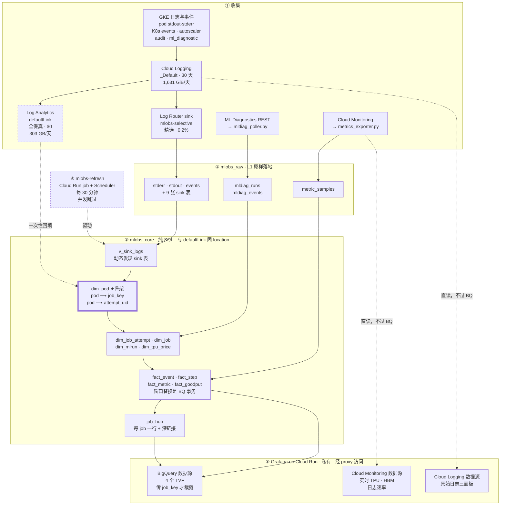
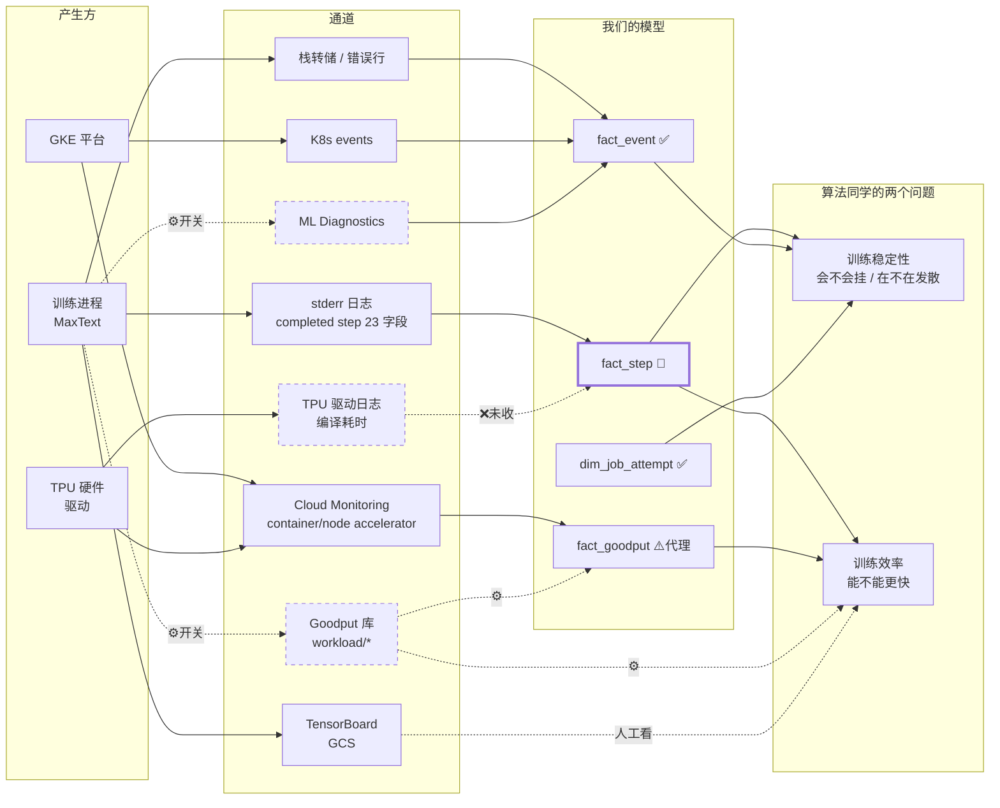

# ML 训练聚合监控与分析平台

面向 GKE 上 TPU 训练的聚合可观测平台。把散落在日志、指标、ML Diagnostics 里的信号
收敛成**以 job 为中心**的一份数据，回答三个现有工具答不了的问题：

1. **这个 job 为什么慢 / 卡 / 挂了？** —— 一条时间线，所有来源
2. **TPU 时间有多少是有效的？每个 job 花了多少钱？** —— Goodput 与成本
3. **我该看哪儿？** —— 每个 job 一个 URL

目标环境：`tpu-for-training`（生产）与 `tpu-launchpad-playground`（测试）。
同一份代码部署到两个项目。

> 文中数字都标了来源。**实测**＝对真实环境的直接测量；**估算**＝基于实测的推算。
> 价格来自 Cloud Billing Catalog API。

---

## 目录

1. [设计原则](#1-设计原则)
2. [环境实测底数](#2-环境实测底数)
3. [两个视角、两个使用者](#3-两个视角两个使用者)
4. [架构](#4-架构)
5. [Grafana 面板](#5-grafana-面板)
6. [当前状态](#6-当前状态)
7. [成本](#7-成本)
8. [待决策与已知缺口](#8-待决策与已知缺口)
9. [路线图](#9-路线图)
10. [运行方式](#10-运行方式)
11. [Caveats](#11-caveats)
12. [踩过的坑](#12-踩过的坑)

**两个附录，各自自包含（大全 + 地图）：**

- **[附录 A：日志](docs/logs.md)** —— 27 个日志渠道 + 4 个 API 渠道的完整清单、
  按意图导航、归属方式、每条渠道的路由决策（留 Cloud Logging 还是进 BigQuery）、待办
- **[附录 B：指标](docs/metrics.md)** —— 五个来源 × 两个视角、全量能力地图（167 个
  实测有数据）、goodput 算法拆解、新增指标的决策规则、要客户打开的开关

---

## 1. 设计原则

### 1.1 只依赖 GCP 与 Kubernetes 原生

信号只取自：容器日志、K8s 事件与对象、Cloud Monitoring 指标、ML Diagnostics API。
**不接入任何客户自建系统的私有接口或内部指标。**

`falcon-jobs` 的任务由 **kubemaker**（蚂蚁自建的类 Kubeflow 调度器）产出。平台只认它
产出的**标准 K8s 对象**——pod、Job、事件、label——不碰它的调度队列、状态机、
内部 API。原因是可移植性：换个客户或 kubemaker 改版，标准对象仍然在。

同一条原则决定了 `dim_pod` 的骨架是 **K8s 事件**而不是容器日志：事件是 Kubernetes
保证产生的，日志内容取决于业务代码怎么写。

### 1.2 价值在 join，不在画图

现状不是「没有监控」，而是**监控是碎的**：11 个 Dashboard、7 条告警、Cluster
Director、Logs Explorer 四个入口，彼此没有共同实体。平台的核心产出是**统一实体**
（job ↔ attempt ↔ pod ↔ node ↔ chip ↔ owner ↔ 成本），不是又一批图表。

### 1.3 先盘点，再开发

新增任何指标或图表之前，先查[能力地图](docs/metrics.md#45-全量能力地图167-个)。

代价实例：本平台用 tensorcore 利用率自建了 goodput 代理算法，而 GKE 本身就发布
`kubernetes.io/jobset/proxy_runtime_goodput`。

---

## 2. 环境实测底数

### 2.1 集群与工作负载

| 项 | 值 |
|---|---|
| 集群 | `tpu-training-antgroup`（143 节点，GKE 1.34.9）、`tpu-training-antgroup-v2`（8 节点），均 us-central1 **regional** |
| TPU 节点池 | 37 × `tpu7x-standard-4t`、2 × `ct5p-hightpu-4t`（v5p） |
| Log Analytics | `_Default` 已启用，linked dataset **`defaultLink` 已存在**（**US 多区域**） |
| GMP | 已开，`autoMonitoring scope=ALL`；DCGM + JOBSET + CADVISOR + KUBELET |
| 已有资产 | 11 个 Dashboard、7 条 Alert Policy、4 个 log-based metric |

**四个工作负载族并存**，实体建模必须同时覆盖：

| 族 | 命名空间 | Pod 命名 | K8s 类型 | 生产 job 数 |
|---|---|---|---|---|
| **falcon**（kubemaker 产出，当前主力） | `falcon-jobs` | `falcon-job-<id>-<idx>-<hash>` 或 `falcon-job-<id>-<hash>` | Job | **1,540** |
| JobSet / MaxText | `default` | `<jobset>-worker-<n>-…` | JobSet | 201 |
| 普通 Job | `default` 等 | 各异 | Job | 72 |
| Deployment / DaemonSet | 各处 | — | Deployment 等 | 19 |

pod label 里有现成的 join key：

```
logging.gke.io/top_level_controller_name        job 名（权威，覆盖率 100%）
k8s-pod/jobset_sigs_k8s_io/jobset-name          JobSet 名（JobSet 族用这个）
k8s-pod/batch_kubernetes_io/controller-uid      一次尝试的 UUID
k8s-pod/falcon_io/{job-id, exp-id, cluster-id}  falcon 的业务标识
k8s-pod/owner                                   成本归属
```

### 2.2 日志规模

来自 `logging.googleapis.com/billing/bytes_ingested`，14 天均值：

| 项 | 实测 |
|---|---|
| **计费摄入量** | **1,631 GiB/天**（`k8s_container` 占 99.6%） |
| 日志条数 | ~12.4 亿条/天 |
| **单条平均计费体积** | **~1.4 KB** —— 而 payload 只有 **273 B** |

> **80% 的日志账单是 labels/metadata，不是日志内容。** 按 payload 长度估算会低估 5 倍。

severity 分布（1 天）：`WARNING` **9.33 亿（75%）** · `INFO` 2.97 亿 ·
`ERROR` 238 万 · `DEFAULT`/`DEBUG` 343 万 · `CRITICAL` 24。

**信噪比**：falcon-jobs 6 小时内 6.24 亿条日志，含 `loss` 的 7,854 条 ——
训练指标信号占 **0.0013%**。

### 2.3 BigQuery 扫描成本剖面

这组数字决定了建模层怎么写。`defaultLink` 上**每天数据**的扫描量：

| 查询触及 | 扫描量 |
|---|---|
| 只读 `timestamp` | 9.9 GB |
| `+ severity` | 20 GB |
| `+ resource` | 174 GB |
| `+ json_payload` | 245 GB |
| **`+ labels`** | **303 GB** ← 最贵 |
| `log_id='events'` + labels | **10.5 GB** ✅ |
| `severity>=ERROR` + payload | **11.9 GB** ✅ |
| **精选 sink 上读同样的 labels** | **813 MB** ← 便宜 **373 倍** |

**只有 `log_id` 和 `severity` 能有效裁剪。** 建模层因此只读这两个可裁剪切片和
sink，从不扫全量 payload。

> 一个 job 到底能查到哪些日志渠道（实测 27 个日志 + 4 个 API），以及算法同学
> 「我想知道 X 该看哪儿」的导航表，见 [附录 A](docs/logs.md)。

### 2.4 保留与降采样

| 数据 | 总保留 | 原分辨率窗口 | 之后 |
|---|---|---|---|
| 日志（`_Default`） | 30 天（可调，$0.01/GiB·月） | — | — |
| `kubernetes.io/*`、`custom.googleapis.com/*` | 24 月 | **6 周** | 10 分钟 |
| `prometheus.googleapis.com/*`（GMP） | 24 月 | **7 天** | 1 分钟（5 周）→ 10 分钟 |
| **log-based metrics** | **仅 6 周** | — | — |

goodput 用 5 分钟桶 —— **超过 6 周 Cloud Monitoring 只剩 10 分钟粒度**。这是
BigQuery 副本必需而非冗余的根本原因。

---

## 3. 两个视角、两个使用者

这个平台要回答的问题分两类。它们的使用者、分母和紧急程度都不同，混在一起看会得出
错误结论。

| | **Job 视角** | **集群视角** |
|---|---|---|
| 回答 | 这个任务跑得好不好 | 买的卡有没有在产出 |
| 使用者 | 算法同学 + SRE | 平台负责人、财务 |
| 分母 | 这个 job 的墙钟时间 | **集群总芯片 × 时间**（不管有没有 job） |
| 代表指标 | goodput、MFU、step time、中断次数 | 芯片占用率、空闲卡数、$/有效卡时 |
| 现状 | ✅ 已做，goodput 精度待提升 | ❌ **几乎没做** |

**Job 视角永远看不见「没跑起来的卡」。** 实测集群 **488 张卡，432 张有容器，
298 张在忙 = 61%** —— 那 56 张连 pod 都没有的卡，每个 job 的 goodput 都报 100%
也照样在烧钱。这是集群视角必须单独建的原因。

### 3.1 算法同学关心的两件事

| | **训练稳定性** | **训练效率** |
|---|---|---|
| 回答 | 会不会挂 · 是不是在发散 | 同样的卡能不能跑更快 |
| 时间尺度 | **秒级到分钟级**，要告警 | 小时级，看趋势 |
| 看错的代价 | 烧几小时卡时训出一个废模型 | 慢 10% |
| 最该盯 | `nan_iters`、`grad_norm`、重启次数 | `TFLOP/s/device`、MFU、step time 方差 |

**紧急程度差一个量级**，所以稳定性做告警、效率做趋势图。

稳定性最关键的三个信号**今天就在 sink 里流着，不用开任何开关** ——
一条 `completed step` 日志有 23 个字段，`nan_iters` / `skipped_iters` /
`grad_norm` 都在里面。`mlobs_core.fact_step` 已经把它们建成表，
Grafana 里是「训练稳定性与效率」那一行。详见[附录 A §7](docs/logs.md)。

### 3.2 SRE 关心的

硬件健康、任务连续性、中断归因 —— 主要靠 `fact_event` 的统一时间轴
（6 个来源）和节点级指标。归属方式见[附录 A §3](docs/logs.md)。

### 3.3 指标来源

五个来源、全量能力地图（实测 **9,594 个描述符 → 167 个有数据 → 24 个真正要用**）、
以及「新增指标放哪」的决策规则，全部在**[附录 B](docs/metrics.md)**。

三条关键结论：

- **框架的同一份指标有 6 个出口**（stdout、TensorBoard、本地文件、GCS、
  ML Diagnostics、Cloud Monitoring），选哪条是纯配置问题。**当前走的是最差的
  那条 —— 从 stdout 解析**，代价是要去重、无 schema、格式变更静默失效。
- **按层展开的量永远不要进 Cloud Monitoring。** 生产里 771 个死描述符中 183 个是
  `Router_*_layer_N`，全部零数据 —— 该路径曾启用后废弃。
- **集群视角要用 node 级指标。** 实测 `node/accelerator/tensorcore_utilization`
  有 504 条序列，容器级只有 456 条 —— 差的 48 条正是**没有 pod 的芯片**，
  在容器级指标里不是 0 而是根本不存在。

---

## 4. 架构

分层交互图：[`docs/architecture.html`](docs/architecture.html)（下载后用浏览器打开；
源规格 [`docs/architecture.arch.json`](docs/architecture.arch.json)，由 archify 渲染）。
它画的是五层之间实际流动的数据，带三条导览路径：客户主路径、财务分子与分母、日志与事件。
本节的 mermaid 图覆盖面更全，两者互补——交互图突出主干，mermaid 图列全表名。

### 4.1 总体



**三条读路径，成本差三个数量级，这是整个架构的关键取舍：**

| 路径 | 什么时候走 | 成本 |
|---|---|---|
| **Cloud Logging 直读**（⑤ G3） | 人要看原文 | **$0** —— ingest 已付 |
| **Cloud Monitoring 直读**（⑤ G2） | 要实时值，不需要 join job | **$0** |
| **BigQuery**（③④） | 要排序、聚合、跨渠道 join、超过 30 天 | 扫描计费 |

判据与逐渠道决策见[附录 A](docs/logs.md)，指标侧见[附录 B](docs/metrics.md)。

**图例：**

- **粗框 `dim_pod` 是骨架。** Cloud Monitoring 只给 `pod_name`，日志只给 pod/node，
  ML Diagnostics 只给自己的 run id —— **没有任何一个渠道知道「job」是什么**。
  `dim_pod` 是唯一回答「这个 pod 属于哪个 job」的地方，所有东西都从它 join 出去。
- **虚线 `defaultLink`** 全保真、$0，但**每天 303 GB**，只用于一次性回填和人工排查。
  模型不读它：早期版本读了，$1,240/月。
- **④ 的窗口替换是 BigQuery 事务。** 两次刷新重叠时，读者会看到 `fact_event`
  只有 273 行而不是 310 万行（实测）。事务 + ⑥ 的并发跳过，两层都需要。

### 4.2 部署视图：GCP 服务与身份

哪个服务部署在哪、用什么身份、数据落在哪个 location。


> 由 `tools/render_deployment.py` 生成，图标是 Google 官方 Cloud icon set。
> 改完重新跑一次即可。


**计算全部在 `us-central1`，数据全部在 US 多区域，这是被迫的。**
`defaultLink` 由 Cloud Logging 托管、固定在 US 多区域，而 **BigQuery 不能跨
location join**。`mlobs_raw` / `mlobs_core` 必须跟着建在 US；建成 `us-central1`
会在第一次 join 时失败。`deploy.sh` 读 `defaultLink` 的 location 并跟随，不写死。

| 组件 | 服务 | Location | 身份 |
|---|---|---|---|
| 训练负载 | GKE `tpu-training-antgroup` | us-central1 | — |
| 日志落地 | Cloud Logging `_Default` | global · 30 天 | — |
| 精选导出 | Log Router sink `mlobs-selective` | global | `service-…@gcp-sa-logging` |
| 原始层 | BigQuery `mlobs_raw` | **US** · 物理计费 | — |
| 建模层 | BigQuery `mlobs_core`（纯 SQL） | **US** · 物理计费 | — |
| 展示 | Cloud Run 服务 `mlobs-grafana`（IAP）与 `mlobs-grafana-direct`（无 IAP） | us-central1 · 均私有 | `mlobs-grafana`（两者共用） |
| 刷新 | Cloud Run job `mlobs-refresh` | us-central1 | `mlobs-refresh` |
| 触发 | Cloud Scheduler `mlobs-refresh` | us-central1 · 每 30 分钟 | `mlobs-scheduler` |
| 镜像 | Artifact Registry `mlobs` | us-central1 | — |

**三个服务账号，权限互不重叠**：

| SA | 项目级 | 数据集级 |
|---|---|---|
| `mlobs-grafana` | `bigquery.jobUser` · `logging.viewer` · `monitoring.viewer` | `mlobs_raw` / `mlobs_core` **READER** |
| `mlobs-refresh` | `bigquery.jobUser` · `monitoring.viewer` · `hypercomputecluster.viewer` · `run.viewer` | `mlobs_raw` / `mlobs_core` **WRITER** |
| `mlobs-scheduler` | — | 仅 `mlobs-refresh` job 上的 `run.invoker` |

**没有任何身份能读 `defaultLink`**（每天 303 GB，模型只读 sink）。
以 `mlobs-grafana` 身份实跑确认：查 `mlobs_core` 成功，查 `defaultLink` 被拒绝。

**没有 VPC、没有负载均衡、没有持久卷。** Grafana 的 SQLite 是一次性的，dashboard
和数据源都从镜像 provision，所以服务能缩到 0 实例，也能删了重建。

---

### 4.3 指标与日志溯源

同一份数据可以从好几条通道拿到，选错通道的代价很大（见[附录 B](docs/metrics.md)）。
链路是**产生方 → 通道 → 模型 → 要回答的问题**，按算法同学关心的两个问题组织。
虚线是当前的缺口。



三条虚线是全部缺口：Goodput 库（**开关**，`primatrix/maxtext` PR #958 已提，合并后
新启动的 job 自动有）、ML Diagnostics 指标流（**开关**，未推）、TPU 驱动的编译耗时
（要开发）。粗框 `fact_step` 同时喂两个问题，原料已在 sink 里，
详见[附录 A](docs/logs.md)。

### 4.4 事实层的骨架：从原子表往上聚合

财务与效能这一整条链路，只有一个测量点，其余都是它的聚合。

```
                     采集                        原子事实                 聚合
  node/accelerator/{tensorcore,duty_cycle,        fact_chip           chip_hourly      ← 客户宽表
    memory_bandwidth}  每芯片每5分钟一条序列  →  每芯片×5分钟       →  每芯片×小时
                                                 460万行/35天           1.2万行/天
                                                        │
  container/accelerator/tensorcore                      │            fin_work_daily   → fin_daily
    （只用来判定"这块卡上有谁的作业"）                     └──────────→  每天一行            财务口径
                                                                       41 行
  compute/reservation/{reserved,used}  ────────────→  fin_capacity_daily
    （分母，按预留而非按芯片）                            每预留每天
```

**为什么加速器指标取 node 级而非容器级。** node 级每块物理芯片一条序列，
无论上面有没有 Pod 都上报。三个后果：

- 空闲芯片计为 0% 而不是从平均里消失 —— 这正是被替换的那个 GCP 面板的错误
- **序列数本身就是已开出的芯片数**，`vm_chip_hours` 因此可测，而不是推断出来的
- 一块芯片只有一个读数。容器级把芯片归给声称拥有它的容器，Pod 交接时同一块硅片
  会被报两次，实测使 `fin_daily` 系统性偏高 6.0%–9.1%

无交接干扰时两者逐点相同（180 块芯片，中位差 0.0000pp）；有交接时 node 级是物理真值。

**为什么只有一个原子表。** 曾经有三处各自从原始指标推导同样的五个量，各带一套
权重规则 —— 有的按相邻采样间隔积分、有的按固定 5 分钟桶计数 —— 结果日表与
5 分钟表差 13%–17%，而每次对账都要重新判断哪个对。现在只有一个推导，这个问题
不是被解决，是不再存在。

**分母为什么分在两张表。** 预留了但没开出 VM 的芯片不产生任何序列：没有节点、
没有容器、没有指标。「每芯片一行」的表结构上无法容纳它 —— 不能为不存在的实体造行。
所以 `paid` 只能按预留计，其余四层按芯片计。这也是把宽表自己汇总当分母会错的原因：
那样得到的是「有数据的芯片」而不是「买了的芯片」。

**`duty_cycle` 的一个限制。** 它按 TPU 切片坐标编号（`<实例>-4 -5 -12 -13`），
与物理芯片不是一一对应：同一时刻 tensorcore 与 memory_bandwidth 各报 512 块、
128 个实例、恰好 4.00 块/实例，而 duty 报同样 512 块却分布在 120 个实例上、
4.27 块/实例。因此 `fact_chip` 的芯片轴取 tensorcore 的编号（主机内 0–3，
与容器级拼写一致），duty 以**实例均值**挂到该实例的 4 行上 —— 按实例及以上聚合
完全精确，只有同主机内两块芯片的对比是近似。

**`chip_id` 自带实例身份。** 格式是 `<GCE 实例 ID>-<0..3>`，前缀就是节点的
instance id（与 `compute instances describe` 核对一致），所以芯片↔实例不需要
映射表，`SPLIT` 即可。

**两段分辨率，靠 `interval_s` 统一。** 采集器只能向前跑，所以事实层原本从它上线
那天开始。Cloud Monitoring 实际能回溯到 **2026-03-11**——集群 `tpu-training-antgroup`
的创建时间，不是保留边界。取回来的数据有两种分辨率：六周以内是原生 300 秒，
更早一律降采样到 600 秒。

`fact_chip` 因此带 `interval_s` 列，`11_fact_chip.sql` 写 300，
`11h_fact_chip_history.sql` 从 `mlobs_raw.metric_hourly` 按小时写 3600。所有下游
一律按 `pct/100 × interval_s/3600` 加权，不再数行数。**数行数在只有一种分辨率时是对的，
在第二种到达的那一刻会把历史的每个分子砍掉 12 分之 11，而且不报任何错。**
改完在已有的 35 天上逐日比对，五个量的最大差都是 `0.0`。

历史段的上线时长是实测的：抓取时同时取 `ALIGN_MEAN` 和 `ALIGN_COUNT`，
在内存里按 (序列, 时间戳) 合并，`interval_s = count × 600`。只取均值的话，
一个在整点前十分钟才起来的节点会被记成整整一芯片小时。

`metric_coverage` 闸门也因此改成度量 `fact_chip` 本身而不是 `fact_metric`：
后者是容器级、历史段没有数据，闸门读到 0，把 184 天里 143 天的四个比率全部置空——
数据在、正确、但不可见。**闸门必须度量它要守的那张表。**


### 4.5 四个资源效能口径

```
                     分母 = 买下的产能              分母 = 已交付的 VM
有 Pod 调度          global_allocate_rate          tpu_allocate_rate_in_vm
                     pod ÷ paid                    pod ÷ scheduled
加速器在跑           global_tpu_utils              tpu_utils_in_vm
                     duty ÷ paid                   duty ÷ scheduled
```

`global_X = X_in_vm × 预留占用率`，因为 `vm` 约掉。四个比率在 `fin_daily` 里
已按各自的覆盖率闸门置空，下游不需要再判一次。

**「利用率」指 `duty_cycle` 而非 `tensorcore_utilization`**，与既有口径一致：
被替换的 GCP 面板里「芯片利用率 % (utilized/scheduled)」和「集群 Duty Cycle 均值」
都基于 duty，tensorcore 在那里标的是「Per-job MFU 代理」。两者都保留 —— duty 回答
「卡有没有在跑」，tensorcore 回答「用掉了多少算力」，近 30 天前者约为后者的两倍多，
差额是访存受限与通信受限的负载，`membw_chip_hours` 用于区分这两者。

### 4.6 `dim_pod`：pod → job 的映射

Cloud Monitoring 的时间序列只带 `pod_name`。要把指标关联到 job 必须有映射，
三种做法只有一种可靠：

| 做法 | 结果 |
|---|---|
| 正则解析 pod 名 | ❌ 把 **1,292 个 pod** 错分到裸 `falcon-job`（falcon 有两种命名形态） |
| 以 ML Diagnostics 为骨架 | ⚠️ 覆盖率 97.5%，但依赖 poller 新鲜度 |
| **读 GKE label** | ✅ `logging.gke.io/top_level_controller_name` 在训练命名空间覆盖率 **100%** |

正则只作兜底（`job_key_from_pod_fallback`），**匹配不上返回 NULL** ——「不知道」
比「猜错」好。

**数据源必须包含 K8s event。** sink 只收 ERROR+ 和 `completed step`，健康又安静的
job 两样都不产生。加入 event 前后：生产可见 falcon job **589 → 1,540**，
JobSet **65 → 201**。

### 4.7 两个粒度：`job_key` 与 `attempt_uid`

| 键 | 含义 | 缺失的后果 |
|---|---|---|
| `job_key` | 人所说的 job（JobSet 族取 JobSet 名，不是子 Job） | 用子 Job 名会和 MLDiag 的 workload 名对不上 |
| `attempt_uid` | 一个 Job 对象 = 一次尝试（`batch.kubernetes.io/controller-uid`） | 同名复用会被合并：`henry-hlo-test` 7 周内跑了 **101 次** |

非 Job 工作负载（Deployment/DaemonSet）没有 controller_uid，回落到 controller 名。

### 4.8 五条收集路径

| 路径 | 承载 | 不可替代之处 |
|---|---|---|
| `defaultLink`（Log Analytics） | 全量，30 天 | 免费全保真；但重复扫描贵，受保留期限制。只用于一次性回填和人工排查 |
| sink `mlobs-selective` | ERROR+、`completed step`、**k8s event**、autoscaler、TPU runtime、mldiag event、audit | 永久保留 + 反复查询便宜（813 MB vs 303 GB）。~180 万行/天 |
| `metrics_exporter.py` | tensorcore、log_entry_count、goodput/badput/elapsed/disruptions、reservation reserved+used | 这些是指标不是日志。`log_entry_count` 零成本检测日志风暴；reservation 两个是财务口径唯一的分母来源 |
| `mldiag_poller.py` | ML run、monitored event、analyzer 判定 | 只有 REST，`gcloud` 无 `mldiagnostics` 命令组。支持多 region |
| **Cloud Asset Inventory** | node pool 的**配置历史**（35 天） | 唯一能回溯已删除资源配置的通道。日志记录的是「发生了什么」，它记录的是「当时长什么样」——两者不能互相替代，详见 4.6.1 |

#### 4.8.1 资源配置不在日志里：一次找错层级的教训

`capacity_class`（这个 pod 跑在预留还是按需容量上）是财务口径的分母过滤条件。
falcon 在一个 job 的生命周期内创建并删除 node pool，所以靠 GKE API 轮询的
`node_pool_snapshot.py` 只认得当下存在的池：2026-09-04 实测，31 天里 dim_pod 出现过
**1,378 个实例组，它只认得 58 个**。`work_coverage` 因此在 0.09–0.90 之间，
把 09-01 以前的卡利用率和 MFU 全部压成 NULL。

按「日志里总能找到」的思路找了三条路，全部走死，而且**死因相同——在错误的层级找东西**：

| 尝试 | 结果 | 为什么 |
|---|---|---|
| 从节点名解析池名 | 失败 | 短式命名 `gke-tpu-3cf4ffd9-w09c` 只带 8 位实例组哈希，不含池名 |
| `compute.instances.insert` 审计日志 | 失败 | request 体只有 `@type`。GKE 经实例组管理器创建节点，不存在每实例的创建请求 |
| `instanceGroupManagers` 审计条目 | 不可靠 | 确实同时含池名和哈希，但抽查 5 个缺失哈希只命中 1 个 |

**`reservationAffinity` 是 node pool 的属性，不是 node 的属性**，所以任何节点级通道
都不可能带上它。日志回答「发生了什么」，回答不了「这个资源当时的配置是什么」。

Cloud Asset Inventory 正是后者，一次调用给全三样：

```
config.reservationAffinity   容量类别 + 具体预留名
instanceGroupUrls            节点名里那 8 位哈希
readTime                     35 天窗口内的任意时点快照
```

`collect/backfill_node_pools_asset.py` 拉 31 天日快照，写进
`node_pool_snapshot` **同一张表、复用同一个 `to_rows()`**——所以容量类别的判定规则
只有一份，两条来源不可能漂。实测效果：

| | 之前 | 之后 |
|---|---|---|
| `dim_node_pool` 实例组数 | 58 | **573** |
| `work_coverage`（08-21） | 0.093 | **1.0** |
| 卡利用率有效天数 | 3 | **26** |
| MFU 有效天数 | 3 | **26** |

补齐之后才看得见的东西：卡利用率在 08-05..08-16 是 **1.9–4.1%**，08-17 起跳到
**10.6–17.7%**。同期预留占用率一直是 80–98%——预留芯片确实发给了 VM，上面却没在算。
`fact_step` 的源头也对得上（08-06 有 88,446 行步骤日志，08-28 有 352,461 行）。
三条独立来源同向，所以这是真实拐点，不是采集起点造成的假象——两个覆盖率列在整段
区间都是 1.0，正是为了把这两种情况区分开才引入的。

三个约束值得记住：Asset Inventory 是 **35 天滚动窗口且只向前滚**，没抓的历史永久
丢失；日快照会漏掉活不到 24 小时的池（1,378 里有 906 个），目前无害是因为那些 pod
被 `job_family='falcon'` 兜底，若哪天去掉那条规则就得改小时级；08-11/12/13/15/16
这五天 `work_coverage` 停在 0.71–0.87 仍被闸掉，就是日快照漏池的直接后果。

**`severity=WARNING` 刻意不入 sink**：9.33 亿行/天，几乎全是两次 gcsfuse 风暴。
日志「量」的异常由免费的 `log_entry_count` 指标发现。

### 4.9 目录结构

三个部署脚本，各管一层，因为它们的爆炸半径和重部署频率都不同。
`./deploy.sh` 默认把三层都装好，`STAGES=data` 只装数据面。

```
observability/
├── README.md                       本文档
├── deploy.sh                       ① 数据面：dataset + sink + model + 首次填充
│                                     默认还会调用 ② ③（STAGES 控制）
├── refresh.sh                      增量刷新的实际逻辑（本地跑或被 ② 调用）
├── lib/
│   ├── gcp.sh                      三个部署脚本共用：建 SA、授角色（带传播重试）、
│   │                                 授 dataset ACL（读-改-写 + 校验没丢条目）
│   └── dataset_access.py           dataset ACL 的读-改-写与校验
├── collect/
│   ├── create_log_sink.sh          精选 Log Router sink
│   ├── mldiag_poller.py            MLDiag REST → mlobs_raw（多 region）
│   ├── metrics_exporter.py         Monitoring → metric_samples（幂等，按块落库+token 自续期）
│   ├── node_pool_snapshot.py       GKE API → node_pool_snapshot（*/5min，只见当下）
│   ├── load_tpu_price.sh           从 GCS 载入费率卡；费率不进 git
│   ├── backfill_node_pools_asset.py  一次性：Asset Inventory 35 天配置史 → 已删除池的容量类别
│   ├── backfill_pod_labels.sh      一次性：sink 建立之前的 pod→job 映射（整窗重跑约 $67）
│   └── backfill_step_lines.sh      一次性：sink 建立之前的 `completed step` 行（按天跳过）
├── model/
│   ├── 00b_dim_config.sql          部署事实（project_id、日志保留期），job_hub 依赖
│   ├── 11_fact_chip.sql            原子事实：每芯片每 5 分钟
│   ├── 12_chip_hourly.sql          客户宽表：每芯片每小时
│   ├── build_v_sink_logs.py        动态发现 sink 表
│   ├── 00_functions.sql            api_ts()、job_key_from_pod_fallback()
│   ├── 01_dim_pod.sql              ★ 骨架
│   ├── 02_dim_mlrun.sql            MLDiag run + 事件
│   ├── 03_dim_job.sql              dim_job_attempt + dim_job
│   ├── 04_fact_event.sql           统一事件流（6 源，窗口替换是事务）
│   ├── 05_dim_tpu_price.sql        TPU 价格维表
│   ├── 06_fact_goodput.sql         fact_metric + fact_goodput（同上）
│   └── 08_views.sql                job_hub + 4 个 TVF + 深链接
├── schedule/                       ② 定时刷新：Cloud Run job + Cloud Scheduler
│   ├── deploy.sh
│   ├── Dockerfile                  google/cloud-sdk:slim + collect/ + model/
│   ├── cloudbuild.yaml             构建上下文是 observability 根
│   └── entrypoint.sh               取 token；检测到并发执行就跳过
├── serve/                          ③ 展示层
│   ├── README.md                   选型与部署
│   ├── LOOKER_STUDIO.md            对外分享面（可选）
│   └── grafana/                    Cloud Run 上的 Grafana
│       ├── deploy.sh
│       ├── build_dashboard.py      dashboard JSON 由代码生成
│       └── provisioning/           三个数据源：BQ / Cloud Monitoring / Cloud Logging
├── serve/share/
│   └── create_share.sh             mlobs_share 数据集：9 个对外视图 + 只读 SA
│                                   建完逐个实查，编译通过不等于能查
├── tools/
│   ├── build_capability_map.py     生成能力地图
│   ├── render_deployment.py        画部署视图（官方 GCP 图标）
│   └── deprecate_legacy_metrics.sh 废弃自定义指标（dry-run；看清注释再跑）
└── docs/
    ├── logs.md                     附录 A：日志（大全 + 地图 + 路由 + 待办）
    ├── metrics.md                  附录 B：指标（大全 + 地图 + goodput + 开关）
    ├── deployment.svg              部署视图，由 tools/render_deployment.py 生成
    └── generated/                  工具产物，勿手改
        ├── capability-map-prod.md
        └── capability-map-prod.json

```

---

## 5. Grafana 面板

### 5.1 两个入口

两个 dashboard：

| UID | 内容 |
|---|---|
| `mlobs-jobs` | **任务索引**。上半区当前在跑的 job（起始时间、芯片数），下半区历史 job 按启动时间降序。每行点进去带 `job_key` 参数跳到详情页 |
| `mlobs-job` | **单个 job 的详情**，七个分区（§5.3）。顶部下拉也可直接选 job |

自动刷新 1 分钟，默认时间窗 24 小时。

同一份 dashboard 由**两个 Cloud Run 服务**提供，镜像与服务账号完全相同，区别只在
认证方式。这不是冗余部署，是 IAP 的一个硬约束：开启 IAP 后它会拦截该服务的**每一个**
入站请求，包括携带 ID token 的 IAM 直连请求（回 `Invalid IAP credentials: Invalid
JWT audience`，浏览器渲染成 `Error code 9`）。所以一个服务无法同时服务 IAP 用户和
proxy 用户，只能拆成两个。

| 服务 | 认证 | 谁用 |
|---|---|---|
| `mlobs-grafana` | IAP | `antgroup.com` 账号 |
| `mlobs-grafana-direct` | 无 IAP，Cloud Run IAM | 组织外账号（含 `google.com`） |

两个服务都是私有的（`--no-allow-unauthenticated`）。

**`antgroup.com` 用户 —— 直接开 URL**

```
https://mlobs-grafana-g4zlqqnjgq-uc.a.run.app/d/mlobs-jobs
https://mlobs-grafana-g4zlqqnjgq-uc.a.run.app/d/mlobs-job?var-job_key=<JOB>
```

**组织外用户 —— 对 `-direct` 起代理**

OAuth 同意屏幕是 Internal 且该字段无法通过 API 修改，组织外账号无法通过 IAP
登录（见 §5.4）。代理必须指向 `-direct`，指向 `mlobs-grafana` 会被 IAP 拦成
`Error code 9`。

```bash
gcloud run services proxy mlobs-grafana-direct \
  --project tpu-for-training --region us-central1 --port 8080
# → http://localhost:8080/d/mlobs-jobs
```

首次会提示装 `cloud-run-proxy` 组件。apt 版 gcloud 用
`sudo apt-get install google-cloud-cli-cloud-run-proxy`。需要在
`gcloud auth login` 过的机器上跑 —— 纯 ADC 签不出 ID token。

### 5.2 授权

两条路互不影响，同一个人可以同时有。

```bash
# antgroup.com 用户：IAP
gcloud beta iap web add-iam-policy-binding --project tpu-for-training \
  --resource-type=cloud-run --service=mlobs-grafana --region=us-central1 \
  --member=user:某人@antgroup.com --role=roles/iap.httpsResourceAccessor

# 组织外用户：-direct 服务的 run.invoker
gcloud run services add-iam-policy-binding mlobs-grafana-direct \
  --project tpu-for-training --region us-central1 \
  --member=user:某人@example.com --role=roles/run.invoker
```

当前名单：IAP 上 `mingliang.gml@antgroup.com`、`wangyunpeng@google.com`；
`-direct` 上 `wangyunpeng@google.com`。

> `mlobs-grafana` 自身的 `run.invoker` 名单里还留着两个用户，是开启 IAP 之前授的。
> IAP 开启后这类授权不再起作用（请求仍会被 IAP 拦下），留着无害但不代表访问权限 ——
> 判断谁能进 `mlobs-grafana`，看 IAP 策略。

`deploy.sh` 部署 `mlobs-grafana` 后，若 `mlobs-grafana-direct` 已存在，会把它更新到
同一个镜像，两边内容不会漂。该服务只在已存在时才被触碰 —— 是否要部署这一对是装的
时候做一次的决定，脚本不替新项目做主。

### 5.3 面板

`mlobs-job` 七个分区，跨三个数据源。

| 分区 | 面板 | 数据源 |
|---|---|---|
| **概览** | Goodput · 峰值芯片数 · chip-hours · 成本（墙钟 / 实测两版）· 采样覆盖率 · 尝试次数，外加一张带深链接的元数据表 | BigQuery |
| **事故时间线** | 事件密度（6 个来源分色）+ 事件明细表 | BigQuery |
| **指标** | TensorCore 利用率（该 job 全部芯片均值）· 日志速率（按容器） | BigQuery |
| **实时指标** | TensorCore 利用率 · HBM 已用 · 日志速率，均按 pod / 容器展开，滞后约 3–4 分钟 | Cloud Monitoring |
| **训练稳定性与效率** | NaN 迭代 · 跳过的迭代 · 重做的 step · 最差 straggler 比 · 最大 step · TFLOP/s 中位，六个状态块带阈值配色；外加 Loss 与梯度范数、Step 耗时（中位 vs 最慢 rank）两条曲线 | BigQuery |
| **原始日志** | 训练主输出（`jax-tpu` / `task` 容器）· 错误（severity≥ERROR）· TPU 驱动与节点层（该 job 节点上的 kube-system 容器） | Cloud Logging |
| **每次尝试** | 同名 job 的每次运行一行，含 goodput、chip-hours、成本、采样覆盖率 | BigQuery |

`mlobs-jobs` 两个分区，都走 BigQuery，数据都来自 `job_hub`。

| 分区 | 口径与排序 | 列 |
|---|---|---|
| **运行中** | 最近 45 分钟内仍有日志；按芯片数降序 —— 出问题时先看大的 | job 名、芯片数、TPU 型号、节点数、开始时间、已运行分钟、goodput、尝试次数、owner、job family |
| **历史** | 其余全部；按开始时间降序 | 同上，另加结束时间、时长、chip-hours、成本 |

两张表的 job 名列都带 data link，点进去打开 `mlobs-job` 并带上 `job_key` 与当前
时间窗（`${__from}` / `${__to}`），不用手动重选。两张表都可按列过滤。

> 「运行中」是**最近 45 分钟内有日志**，不是作业状态。平台读的是日志与事件，拿不到
> 作业的退出码 —— 历史表里的 `ended` 同样是最后一条日志的时间，不代表正常结束。

两个 dashboard 都由 `serve/grafana/build_dashboard.py` 生成（`--out-dir` 输出
`index.json` + `job.json`），不是手维护的 JSON —— 700 行深度嵌套的对象里，一个位置
错了的花括号在 review 时看不出来。

### 5.4 设计取舍

**上下两层，同一个 `$job` 变量联动。** 上层 BigQuery 回答「哪里不对」（排名、聚合、
跨渠道 join），下层 Cloud Logging 回答「具体是什么」（实时原文，未经 sink 过滤）。
两层能力不重叠：Cloud Logging 数据源不支持聚合也不支持告警，返回条数还等于面板的
`MaxDataPoints`；BigQuery 则拿不到实时原文。

**Cloud Monitoring 面板的 pod 范围由 BigQuery 提供**，经一个隐藏变量传入，不靠 pod
名前缀猜 —— `vllm` 同时是 `vllm-tpu` 和 `vllm-qwen3-5-r` 的前缀，前缀匹配会串。
TPU 驱动那个面板同理，用隐藏的 `nodes` 变量按节点圈定。

**每个面板查的是 table function，不是视图。** `job_overview` / `job_timeline` /
`job_metrics` / `job_attempts` / `job_steps` 五个 TVF 把 `job_key` 下推到
`CLUSTER BY`。实测单次加载扫描 **2.3 MB**；直接查视图再在 Grafana 里过滤是 **185 MB**。

**成本给两个数。** `est_usd`（墙钟）与 `est_usd_observed`（实测）并列，同时显示
`sample_coverage` 说明该信哪个 —— 两者失效方向相反：采样有缺口时前者高估、后者低估。

**深链接直达 GCP 控制台。** 元数据表每行带 Logs Explorer、Log Analytics、
Cloud Monitoring、Cluster Director 四个入口，已按 job 预填查询条件。

**颜色固定绑定来源名，不绑排名。** 过滤掉某个来源不会让其余的重新着色。六种色取自
校验过的分类色板，相邻对在两种模式下都通过 CVD 与常视觉分辨门槛。goodput 与采样
覆盖率用保留的状态色，且都带文字标签 —— 颜色从不单独承载状态。

### 5.5 还没接的

**告警。** Grafana 自带的 alerting 可以基于 BigQuery 数据源工作（Cloud Logging
数据源不支持，需要先建 log-based metric 再走 Cloud Monitoring）。`nan_iters` 与
`straggler_ratio` 是最直接的两个候选。需要确认是否要把服务设成 `min-instances=1`
—— 缩到 0 实例时告警规则不会执行。

**TensorBoard 链接。** 路径 `base_output_directory/{run_name}/tensorboard/` 是确定的，
但 `base_output_directory` 还没进 sink，所以暂时给不出链接。

---

## 6. 当前状态

同一份代码部署到两个项目，**不改动任何现有配置** —— 摄入、`_Default` bucket、
11 个 dashboard、7 条告警原样未动。

| 环境 | 采集 | 建模 | 展示 | 定时刷新 |
|---|---|---|---|---|
| `tpu-launchpad-playground` | ✅ | ✅ | ✅ Grafana | ✅ 每 30 分钟 |
| `tpu-for-training`（生产） | ✅ | ✅ | ✅ Grafana（IAP + proxy） | ✅ 每 30 分钟 |

两个环境跑的是同一份代码、同一条 `./deploy.sh`。playground 是重构后的验证环境
—— 每次改部署脚本都先在那儿完整跑一遍，再动生产。

### 6.1 生产部署（2026-08-26）

| 组件 | 名称 | 说明 |
|---|---|---|
| Grafana | Cloud Run `mlobs-grafana` + `mlobs-grafana-direct` | 一对服务，同镜像同 SA，前者开 IAP 给组织内用户，后者不开 IAP 给组织外用户走 proxy —— IAP 会拦截同一服务上的 IAM 直连请求，两类人无法共用一个服务。两者都私有；Grafana 本身匿名 Admin —— 身份已由 Google 证明，再加一道密码没有意义 |
| 数据源 | `mlobs-bq` / `mlobs-cm` / `mlobs-logs` | BigQuery、Cloud Monitoring、**Cloud Logging**（原文层，见附录 A） |
| 刷新 | Cloud Run job `mlobs-refresh` + Cloud Scheduler | `*/30 * * * *`，实测无人值守跑通，各表滞后 1–2 分钟 |
| 镜像仓库 | Artifact Registry `mlobs` | `grafana:v1`、`refresh:v1` |

访问方式与授权命令见 [§5 Grafana 面板](#5-grafana-面板)。

**IAP 的两个前置条件，都踩过。**

一是项目必须有 OAuth 同意屏幕。没有的话 IAP 报 `Error code 9`（OAuth 重定向失败），
而所有 IAM 策略读回来都是对的，很难定位。创建方式：

```bash
curl -X POST -H "Authorization: Bearer $TOKEN" \
  https://iap.googleapis.com/v1/projects/<项目>/brands \
  -d '{"applicationTitle":"...","supportEmail":"<你>@<组织>"}'
```

gcloud 会警告这个 API 已于 2026-03-19 关停 —— 那只针对**新项目**，早于关停日期的
项目仍可调用，`tpu-for-training` 就是这样建的。**brand 不可删除。**

二是这样创建的 brand 是 `orgInternalOnly`，只有项目所属组织内的账号能登录。
本项目属于 `antgroup.com`，所以 56 个 antgroup 用户走 IAP，其余走代理。改成 External
要在 Console 的 Google Auth Platform → Audience 里操作，且改完还要 **PUBLISH**，
否则只有 100 人以内的测试用户名单能进。IAP 只请求 `openid email` 两个非敏感 scope，
发布不需要 Google 验证。

> 开启 IAP 后它会拦截**所有**请求，包括 IAM 直连的（报
> `Invalid IAP credentials: Invalid JWT audience`）。所以半配好的 IAP 会让浏览器和
> 代理两条路同时不通 —— 而两边报错完全不同，看起来像两个独立的问题。

**权限按最小面给**，以各自 SA 身份在 Cloud Run 里实跑确认过：

| SA | 项目级 | 数据集级 |
|---|---|---|
| `mlobs-grafana` | `bigquery.jobUser`、`logging.viewer`、`monitoring.viewer` | `mlobs_raw` / `mlobs_core` **READER** |
| `mlobs-refresh` | `bigquery.jobUser`、`monitoring.viewer`、`hypercomputecluster.viewer` | `mlobs_raw` / `mlobs_core` **WRITER** |
| `mlobs-scheduler` | — | 只有 `mlobs-refresh` job 上的 `run.invoker` |

早期版本在项目级授 `bigquery.dataViewer`，那会让 dashboard 读到客户生产项目里
**所有**数据集（含 `defaultLink` 全量日志）。已收窄，并用一次实跑确认
`mlobs-grafana` 查 `defaultLink` 会被拒绝。

### 6.2 生产模型层规模（2026-09-14 实测）

| | 表数 | 体积 | 行数 |
|---|---|---|---|
| `mlobs_raw` 暂存 | 32 | 91.9 GiB | 1.67 亿 |
| `mlobs_core` 模型 | 28 | 11.4 GiB | 4,600 万 |
| `mlobs_share` 对外 | 9 视图 | — | — |

最大的几张：`stderr` 61.6 GiB、`mldiag_runs` 11.0 GiB、`metric_samples` 8.6 GiB、
`fact_event` 7.6 GiB、`fact_chip` 1.2 GiB。

每 30 分钟一轮刷新，13 个模型文件，实测 370–510 秒。
`fin_work_daily` 与 `fact_chip` 都是 4 天滚动窗口增量，扫描量不随历史增长
（改增量前 `node_metric` 单次扫 899 MiB，之后 141 MiB）。


### 6.3 延迟预算（实测）

| 环节 | 实测 |
|---|---|
| 应用写日志 → Cloud Logging | p50 **2s** / p95 4–5s / p99 4–10s |
| Cloud Logging → **BigQuery sink** | **2–5 秒** |
| 数据完全稳定（无迟到行） | 5 分钟内（固定窗口观察 4 分钟，迟到 **0 行**） |
| Log Analytics / `defaultLink` | 11 秒 |
| Cloud Monitoring 指标完整可见 | ~3–4 分钟 |
| Looker Studio BQ 缓存 | **默认 12 小时 —— 必须手动改** |

sink **不是**瓶颈，是全链路最快的一环。文档里「sink 有时间限制」指的是
**不回溯**（只导出创建之后的日志），不是延迟。

### 6.4 展示层每次刷新的扫描量

| TVF | 扫描量 | 优化前 |
|---|---|---|
| `job_overview(job_key)` | 0.03 MB | 46.9 MB |
| `job_timeline(job_key)` | 0.63 MB | 46.3 MB |
| `job_attempts(job_key)` | 0.00 MB | 46.6 MB |
| `job_metrics(job_key)` | 1.68 MB | 45.6 MB |
| **一次页面加载** | **~2.3 MB** | ~185 MB |

### 6.5 平台产出的实例

**RCA** —— `falcon-job-jaytje07es`，2026-08-24：

```
03:37   64 pods 启动，gke-gcsfuse-sidecar 容器创建
03:42   日志风暴  152,717,258 行 / 5 分钟（~160 万行/pod）
03:52   ML Diagnostics 开出 PERFORMANCE_DEGRADATION —— 9 个 analyzer 全 NOT_DETECTED
03:52 ────── 256 颗 TPU7x 芯片 tensorcore 持续 0.0% ────── 05:37
05:35   容器停止
```

ML Diagnostics 检测到降级但说不出原因；把日志速率放到同一条时间线上，根因一眼可见。
这不是个例：全量 4,127 个 monitored event 中，4,113 个
PERFORMANCE_DEGRADATION **只有 184 个（4.5%）有 analyzer 命中**，历史上只有
`HBM Capacity` 和 `NodepoolInterruption` 两个 analyzer 真正命中过。

**Job 生命周期**（「历史所有 job 启停时间、占用卡数」）：

```sql
SELECT a.job_key, a.first_seen AS started, a.last_seen AS stopped,
       a.observed_duration_s/3600 AS hours, a.pods, a.nodes,
       g.peak_chips, a.owner
FROM mlobs_core.dim_job_attempt a
LEFT JOIN mlobs_core.fact_goodput g USING (attempt_uid)
ORDER BY a.first_seen DESC
```

覆盖 **1,951 次 attempt / 1,832 个 job，1,779 个有 owner 归属**。

---

## 7. 成本

### 7.1 价格事实（Cloud Billing Catalog API，us-central1）

| SKU | 价格 |
|---|---|
| Cloud Logging 摄入 | 前 50 GiB/项目/月免费，之后 **$0.50/GiB** |
| Cloud Logging 保留（>30 天） | $0.01/GiB·月 |
| Log Analytics + linked dataset | **无额外费用** |
| Monitoring API 请求 | **不计价** |
| Monitoring `Time series billed count` | 前 100 万/月免费，之后 $0.50/百万 |
| Monitoring `Metric Volume`（自定义） | 前 150 MiB 免费，之后 $0.258/MiB |
| GMP `Prometheus Samples Ingested` | **$0.06/百万样本**（量大降到 $0.024） |
| BigQuery Analysis | $6.25/TiB（前 1 TiB/月免费） |
| BQ 存储 Physical | Active $0.040 / Long-Term $0.020 per GiB·月 |
| TPU7x（Americas，OnDemand） | **$12.00/hour** —— ⚠️ 单位未核实，见 [Caveats](#11-caveats) |

### 7.2 现状与增量

| | |
|---|---|
| 当前 Logging 月支出 | **≈ $24,400/月**（估算） |
| 清理 `sidecar-log-collector` 噪声后 | **≈ $19,300/月** |
| **本平台增量** | **≈ $150–400/月** |

增量构成：BQ 存储 <$1 · 增量重建扫描 ~$0.01 · sink 写入 ~$46 ·
log-based metrics $13–170 · Cloud Run（Grafana + poller）<$30 ·
Grafana 查询 ~$4（10 人 × 1 分钟刷新）。

**已选路线：原始日志 30 天靠 Log Analytics（$0），聚合事实表永久存 BQ。**
保留期是一个旋钮 —— 需要回看更久时改一条
`gcloud logging buckets update --retention-days`，90 天约 $734/月。

---

## 8. 待决策与已知缺口

以下都是实测确认的，不是猜测。

### 8.1 sink 每天丢 5k–28k 条日志

`mlobs_raw.export_errors` 累计 20.6 万行，仍在增长。原因是 `stderr` 表建表时把
`json_payload` 推断成 RECORD，而 kueue 控制器输出的是 JSON 字符串，类型冲突整条
丢弃 —— 近两天 24,638 条，全部来自 `kueue-controller-manager`，`level` 是
`Level(-2)`（debug，被 GKE 标成 ERROR 严重性）。

丢的不是训练错误，但 kueue 恰好决定「作业为什么没被调度」。sink 的表 schema 由
Cloud Logging 推断，我们无法干预；彻底解决要走 Log Analytics 链接数据集
（`defaultLink` 已存在，payload 是 JSON 类型，不存在这个冲突）。
**最低成本的缓解是给 `export_errors` 行数加一条告警**，至少让它可见。

### 8.2 13 GiB 的 ML Diagnostics 采了没接上

存在两条并行链路，一条在跑一条从未接通：

| 路径 | 数据量 | 状态 | 进 fact_event |
|---|---|---|---|
| 日志 sink `ml_diagnostics_workload_event` | 23,419 行 | 在跑 | 4,351 条 |
| REST 轮询 `mldiag_poller.py` → `mldiag_runs/events` | **13 GiB / 1,900 万行** | `02_dim_mlrun.sql` 从未进刷新序列 | 0 |

手工跑一次 `02_dim_mlrun.sql` 产出 24,793 个 run、8,041 条事件、24,098 个 job 可对上。
两条路**不是重复**：

```
sink 路径    PERFORMANCE_DEGRADATION 4,344 · HANG 7
轮询路径     PERFORMANCE_DEGRADATION 8,020（349 条带根因）
             ORCHESTRATOR_INTERRUPTION 14（全部带根因）← sink 路径完全没有
             HANG 7（全部带根因）
```

轮询路径多近一倍事件，且带 `detected_analyzers` 根因与 `duration_s` 时长。
要么接上（`02_dim_mlrun` 进序列），要么停采（省 13 GiB 与轮询开销）。
两者都比现在好 —— 现在是付着存储费却没有产出。

`03_dim_job.sql` 同样从未进序列，但它的角色已被 `08_views.sql` 的 `job_hub` 取代，
可以直接删除。

### 8.3 对外交付的两个前置动作

- **给 `mlobs-share-reader` 设每日扫描配额**，凭据交付前必须完成。IAM 管得住
  「能读什么」，管不住「读多频」：一条不带时间条件的 `SELECT * FROM v_event`
  单次扫 6.3 GiB，每分钟一次就是 9 TiB/天。
- **凭据方式**：工作负载身份联合（无长期密钥，需对方提供 OIDC issuer）
  优于密钥文件。

### 8.4 已记录的取舍

- `v_job.owner` 是真实邮箱（含 QQ、Gmail、高校地址）。曾改为哈希假名，按要求
  回退为明文 —— 消费方需要联系到人。已在 `create_share.sh` 注明是决定而非疏漏。
- `fact_chip.duty_pct` 是实例均值，见 4.4。
- MFU 已从面板隐藏（峰值按 bf16 取，fp8 任务读数约为真实值一半），
  `mfu_pct` 仍在 `fin_daily` 与 `fin_export` 中可查。


## 9. 路线图

**P0 — 生产化** ✅ **已完成 2026-08-26**
- [x] `refresh.sh` 进 Cloud Run Job + Cloud Scheduler（每 30 分钟，含并发保护）
- [x] Grafana 部署到生产 `tpu-for-training`（三个数据源实测都取到数）
- [ ] 验证 Grafana 告警（BQ 插件自带 alerting，需确认是否要 `min-instances=1`；
      Cloud Logging 数据源**不支持**告警）

**P0' — 历史深度**（现在最大的缺口，见附录 A 的 TBD-1 / TBD-2）
- [ ] `dim_pod` 改成 MERGE 累积 —— 现在是 30 天滚动全量重建，会遗忘
- [ ] 回填补到 30 天 —— 现在只有 3 天，`_Default` 里有 30 天（一次性约 $56）

**P1 — 接入已确认存在的原生信号**（§3.5 的 ★）
- [ ] `node_pool/interruption_count` —— 中断归因，补 ML Diag 4.5% 可操作率的洞
- [ ] `container/multislice/*` 6 个 —— 多 slice hang 诊断
- [ ] `gcsfusecsi/{file_cache_read_count, fs_ops_error_count}` —— 数据管道告警
- [ ] `pod/latencies/pod_first_ready`、`node/latencies/startup` —— 排队与启动
- [ ] JobSet 族改用 `jobset/proxy_runtime_goodput`，并用它校准 falcon 的代理算法

**P2 — 补齐 L4**
- [ ] `fact_step` —— 从 sink 里已有的 `completed step` 行建 loss / MFU / step time
      （33.5 万行/天已落库；行内还带 `peak_tflops_per_device`，正是 MFU 的分母）
- [ ] 自动修复 MTTR —— `dim_job_attempt` + `node_pool/interruption_count`
- [ ] 预留利用率 —— **仍是缺口**，唯一带 `reservation_id` 的指标是 VM 粒度

**P3 — 采集补齐**
- [ ] GKE Operations API poller
- [ ] serial console、checkpoint I/O、XProf 产物索引
- [ ] `ml_diagnostic_workload_performance` 10 秒粒度指标建模
      （join key 已确认：日志的 `resource.labels.node_id` **就是** ML run ID）

**P4 — 分析增强**
- [ ] Dataform 接管建模（依赖图 + 数据断言）
- [ ] `dim_experiment` —— 按 `falcon_io/exp-id` 归组，跨 run 对比
- [ ] BQ Conversational Analytics agent

---

## 10. 运行方式

```bash
export CLOUDSDK_AUTH_ACCESS_TOKEN=$(gcloud auth application-default print-access-token)
```

### 全新安装（幂等，装完就在跑）

```bash
PROJECT_ID=<P> ./deploy.sh
```

它按顺序做：建 dataset（跟随 `defaultLink` 的 location）→ 建 sink → 等 sink 出数
→ 跑全部 model → 首次填充（MLDiag 回填 + 12 小时指标 + 建事实表）
→ 部署定时刷新 → 部署 Grafana。

只装其中一层：

```bash
STAGES=data     PROJECT_ID=<P> ./deploy.sh          # 只装数据面
STAGES=schedule PROJECT_ID=<P> ./deploy.sh          # 只装定时刷新
PROJECT_ID=<P> ./schedule/deploy.sh                 # 等价，直接调
PROJECT_ID=<P> ./serve/grafana/deploy.sh            # 只重部署 dashboard
```

### 看 dashboard

`antgroup.com` 用户直接开 URL，组织外用户走 `gcloud run services proxy`。
两种方式的完整命令与授权见 [§5 Grafana 面板](#5-grafana-面板)。

### 日常运维

```bash
# 手工刷一次（定时任务是每 30 分钟）
PROJECT_ID=<P> MLDIAG_LOCATIONS=us-central1 ./refresh.sh
gcloud run jobs execute mlobs-refresh --project <P> --region us-central1

# 暂停 / 恢复定时刷新
gcloud scheduler jobs pause  mlobs-refresh --project <P> --location us-central1
gcloud scheduler jobs resume mlobs-refresh --project <P> --location us-central1

# 补 sink 建立之前的 pod→job 映射（会扫 defaultLink，先看脚本里的成本说明）
DAYS=30 PROJECT_ID=<P> ./collect/backfill_pod_labels.sh
```

### 常用查询

```sql
-- 某个 job 的完整时间线
SELECT * FROM `<P>.mlobs_core.job_timeline`('falcon-job-xxxx');

-- 最浪费的 job（先看 min_sample_coverage 再信 est_usd）
SELECT job_key, peak_chips, goodput_pct, est_usd, est_usd_observed, min_sample_coverage
FROM `<P>.mlobs_core.job_hub` WHERE chip_hours > 5 ORDER BY est_usd_wasted DESC LIMIT 20;

-- 同名 job 跑了几次
SELECT job_key, attempts FROM `<P>.mlobs_core.dim_job` ORDER BY attempts DESC LIMIT 10;

-- 日志风暴排行（含估算成本）
SELECT * FROM `<P>.mlobs_core.v_job_error_burst` ORDER BY lines DESC LIMIT 20;

-- analyzer 到底命中过什么
SELECT d.analyzer, COUNT(*) n
FROM `<P>.mlobs_core.fact_mlrun_event`, UNNEST(detected) d GROUP BY 1 ORDER BY n DESC;
```

> 在 CAA 受限的 VM 上，`CLOUDSDK_AUTH_ACCESS_TOKEN` 这个环境变量能让整个 gcloud CLI
> 和 kubectl 正常工作，无需在笔记本上操作。

---

## 11. Caveats

**引用任何数字之前请先读这一节。**

- **TPU 价格单位未核实。** SKU `TPU7x running in Americas` 是 `$12.00/hour`，**未说明
  是每芯片还是每主机**。按 per chip-hour 假设（与 v6e SKU 对应其公开的每芯片价格
  一致）。一台 `tpu7x-standard-4t` 有 4 颗芯片 —— **若按主机计，所有金额高 4 倍**。
- **挂牌价，未计承诺使用/预留折扣。**
- **`min_sample_coverage` 低于 0.5 时 `est_usd` 是外推不是实测**，这时看
  `est_usd_observed`。测试环境里曾出现两者差 112 倍的情况。
- **Goodput 有两种口径，`goodput_source` 说明用的哪种。** `measured` 来自训练进程
  自报（`ml-goodput-measurement`），分母是墙钟，配套 14 类 badput 分解。
  `tensorcore_proxy` 是回落算法「5 分钟均值 tensorcore > 10% 的桶占比」，两个已知
  缺陷：它不判断训练是否有效（发散的 run 跑满 100% 也满分），且**分母只是有采样的
  时间** —— 芯片被回收那段不进分母，所以系统性高报。实测同一个 job：measured 8.1%
  vs proxy 22.1%，差 2.7 倍，差额几乎全是 5.2 小时的
  `INFRASTRUCTURE_RECOVERY_FROM_DISRUPTION`。**代理值只在拿不到 measured 时用**。
- **历史深度受两处限制**：回填窗口（生产做了 2 天）和 Log Analytics 的 30 天保留。
- **ML Diagnostics 有效历史约 2 个月**：13,400 个 run 中只有 3 个早于 2026-07-01。
- **能力地图有 16 个指标探测未决**，工具会在输出里显式标 `INCOMPLETE`。
- **`fact_event` 的 app_error 只覆盖 ERROR 及以上**，WARNING 层刻意排除。
- **测试环境用 LOGICAL 存储计费**（项目有 flat-rate commitment，physical 被拒），
  存储成本高于生产口径。

---

## 12. 踩过的坑

按类型归档。都是实测撞出来的，写在这里避免重犯。

### 数据正确性

| 坑 | 后果 | 修法 |
|---|---|---|
| 用正则从 pod 名推 job | **1,292 个 pod** 被塌缩成裸 `falcon-job`（falcon 有两种命名形态） | 读 GKE label；正则只兜底且不确定时返 NULL |
| `job_key` 当唯一主键 | `henry-hlo-test` 7 周内 101 次同名运行被合并 | 引入 `attempt_uid`（controller_uid），双粒度 |
| JobSet 的 `top_level_controller_name` 当 job 名 | 它指向子 Job `<jobset>-worker-0`，和 MLDiag 对不上 | `COALESCE(jobset_name, controller_name)` |
| 只用容器日志建 `dim_pod` | 健康安静的 job 完全不可见（sink 只收 ERROR+ 和 `completed step`） | 加入 K8s event —— 每个 pod 必有 |
| 多源 union 用 `ANY_VALUE` 取标签 | 某些源有值某些源没有，可能返回 NULL | 改用 `MAX()` |
| 指标 exporter 直接追加 | 每 5 分钟跑 1 小时窗口会写 12 遍，goodput 静默翻 12 倍 | 先 DELETE 窗口再 load |
| goodput 假设采样无缺口 | coverage 实测低至 0.009 时成本严重外推 | 同时给 observed 与 wallclock 两个口径 + `sample_coverage` |

### 成本

| 坑 | 后果 | 修法 |
|---|---|---|
| 按 payload 长度估日志成本 | 低估 5 倍（metadata 占 80%） | 用 `billing/bytes_ingested` 指标 |
| 建了 sink 后模型仍扫 `defaultLink` | 单次重建 75.1 GB，15 分钟一次 = **$1,240/月** | `fact_event` 只读 sink（813 MB） |
| `fact_metric` 用 `CREATE OR REPLACE` | 30 天数据全量重建 ≈ **$88/月**，随保留期线性增长 | 改增量 6 小时窗口（$0.01/月） |
| TVF 传参就以为会裁剪 | 视图里的聚合挡住下推，单次 45.6 MB | 物化 `job_hub` / `fact_goodput` / `fact_metric` |

### GCP 平台特性

| 坑 | 表现 |
|---|---|
| `defaultLink` 在 **US 多区域** | BigQuery **不能跨 location 联表**，建模 dataset 必须同 location |
| sink 表是 **camelCase**（`textPayload`），linked dataset 是 **snake_case** | 只认一种拼写会让 2,967 行事件 summary 全空 |
| sink 清洗 label key 为下划线，linked dataset 保留原始点和斜杠 | 回填脚本不做 key 归一化会产出 0 行 |
| 有 flat-rate commitment 的项目拒绝 physical 存储计费 | 需自动降级到 LOGICAL 并告警 |
| `controller_uid` 只在 Job 拥有的 pod 上有 | Deployment/DaemonSet 需回落到 controller 名 |
| `kubernetes.io/anthos/*` 占 kubernetes.io 3,486 个里的 3,360 个 | 不排除会让能力地图候选集爆到 4,406，探测打爆读配额 |
| `compute.googleapis.com/instance/tpu/*` 是 `gce_instance` 粒度 | 只有 instance_id/zone，无 cluster/namespace/pod，归不到 job |
| `tpu.googleapis.com/*` 是 Cloud TPU VM 表面 | GKE 托管的 TPU 在这里几乎没数据（`interruption_count` 全项目 2 条序列） |
| Cloud Run 与 Grafana 都要 `Authorization` 头 | 两层认证必然冲突 —— 认证只放一层，Grafana 跑匿名 Admin |
| 组织策略禁止 `allUsers` | Cloud Run 不可能公开访问，必须走认证 |
| **IAP 需要 OAuth 同意屏幕** | 没配就报 `Error code 9`（OAuth 重定向失败），而所有 IAM 策略读回来都是对的。gcloud 警告创建 API 已于 2026-03-19 关停 —— 那只针对**新项目**，老项目仍可用，别被它劝退 |
| **IAP 开启后会拦截该服务的每一个入站请求**，包括 IAM 直连的 | 报 `Invalid IAP credentials: Invalid JWT audience`（浏览器渲染成 `Error code 9`）。所以**一个服务不可能同时服务 IAP 用户和 proxy 用户** —— 只能部署两个服务（`mlobs-grafana` / `mlobs-grafana-direct`），见 §5.1。半配好的 IAP 会让两条路同时不通且症状不同，很容易误判成两个问题 |
| **brand 是 `orgInternalOnly` 且不可改** | 只有项目所属组织内的账号能通过 IAP 登录，API 无法 PATCH 这个字段（PATCH 返回 404）。组织外的人只能走那个**不开 IAP 的兄弟服务**的 proxy，或在 Console 把同意屏幕改 External 并发布（不发布则只有 100 人测试名单能登录） |
| **IAP 服务上的用户级 `run.invoker` 是失效的** | 开 IAP 前授的 `run.invoker` 不会被清理，读 IAM 策略看着像有权限，实际请求仍被 IAP 拦下。判断谁能进一个 IAP 服务，看 IAP 策略 |
| `gcloud run deploy --iap` 在首次启用 IAP 的项目上会竞态 | 输出里只是一行 `Setting IAP service agent...warning`，但结果是 invoker 策略为空、浏览器报 `You don't have access`，而 IAP 的 IAM 策略看起来完全正确 |
| **数据源缺权限时面板只显示 No data** | Grafana SA 起初没有 `monitoring.viewer`，Cloud Monitoring 面板全空 —— 和「这个 job 确实没指标」长得一模一样，不会报错。每加一个数据源都要单独授它自己的读权限 |
| **Cloud Monitoring 的 filter 不支持 `=~`** | 直接调 v3 REST 会报 `syntax error ... token '=~'`；正则要写 `monitoring.regex.full_match()`。Grafana 的 stackdriver 插件会自动翻译，所以面板里写 `=~` 是对的 —— 但拿这个语法去手工验证会得到误导性的报错 |
| **multi 变量默认只选第一个值** | `pods` 变量 `includeAll: false` 时 Grafana 只选中第一个 pod，Live 面板会画出 64 分之 1 —— 图能出来，但是错的，比 No data 更危险 |
| `gcloud run services proxy` 需要 `cloud-run-proxy` 组件 | apt 版 gcloud 用 `sudo apt-get install google-cloud-cli-cloud-run-proxy`；且用户 ADC 签不出 ID token（`unsupported credentials type`），要在 `gcloud auth login` 过的机器上跑 |

### 工具自身

| 坑 | 表现 |
|---|---|
| 探测失败被当成「无数据」 | 能力地图不可复现，同样输入两次跑出 209 和 48 个指标 |
| `ALIGN_COUNT` 用于 CUMULATIVE/INT64 | 永久 400，重试无用，1,560 个探测被静默丢弃 |
| 按描述符 `metricKind` 选对齐函数 | `metricDescriptors.list` 对很多条目不返回该字段 |
| 依次试多种对齐函数 | 请求量翻倍打爆读配额 |
| 深重试 + 长退避 | 少数限流探测能把整个运行拖到几小时 |

**通用教训：探测类工具必须把「查不到」和「查失败」严格分开**，否则输出永远看起来
是合理的。工具现在会显式输出 `INCOMPLETE` 名单。

---

## 13. 附录

两个附录，各自自包含（大全 + 地图）：

### [附录 A：日志](docs/logs.md)

27 个日志渠道 + 4 个 API 渠道的完整清单（按归属层级 L-pod / L-node / L-cluster
/ L-api）、按意图导航表、归属方式、每条渠道的路由决策、TPU 驱动日志与
ML Diagnostics 三条子渠道的深挖、`fact_step` 的 23 个字段、缺口与 TBD。

判据一句话：**人要「读」的原文留 Cloud Logging，机器要「算」的事实进 BigQuery。**
两者在 Grafana 里是同一页面的上下两层，用同一个 `$job` 变量联动。

### [附录 B：指标](docs/metrics.md)

五个来源（框架自带 / Goodput 库 / GCP 原生 / 日志派生 / 缺口）× 两个视角
（job / 集群）、**全量能力地图**（167 个实测有数据，含标签与基数）、
`ml-goodput-measurement` 的 14 类 badput 算法拆解、五层模型与新增指标决策规则、
771 个废弃自定义指标的处置、要客户打开的开关清单。

> 工具产物在 [`docs/generated/`](docs/generated/)：能力地图的原始生成结果与
> JSON。由 `tools/build_capability_map.py` 生成，不要手改。
