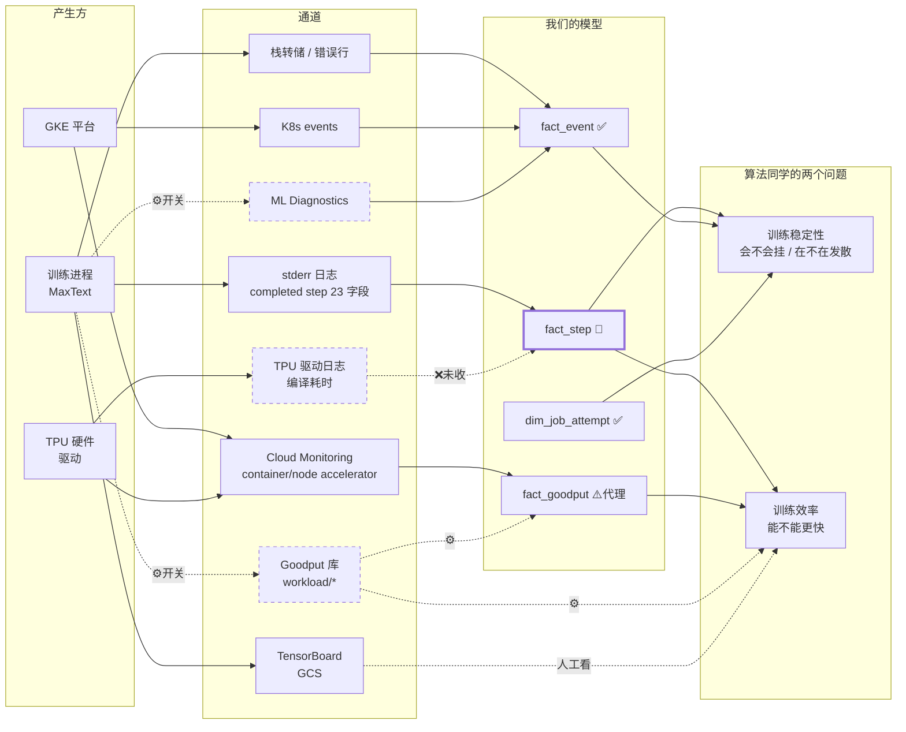

# 算法同学视角：训练稳定性与效率的指标溯源

> 附录 F。渠道全集见[附录 B（日志）](channel-map.md)和[附录 E（指标）](metric-map.md)，
> 这份只回答一个问题：**算法同学该盯什么，每个数从哪来。**
>
> 实测于 `tpu-for-training`，2026-08-27。
> 标记：✅ 现在就有 · ⚙️ **要开开关**（附 §5 清单） · 🔨 要开发 · ❌ 缺口

---

## 0. 两个问题，不要混

| | **训练稳定性** | **训练效率** |
|---|---|---|
| 问的是 | 「我的任务会不会挂 / 是不是在发散」 | 「同样的卡，能不能跑更快」 |
| 时间尺度 | **秒级到分钟级**，要立刻知道 | 小时级，可以事后看 |
| 看错的代价 | 烧几小时卡时训出一个废模型 | 慢 10% |
| 最该盯 | `nan_iters`、`grad_norm`、重启次数 | `TFLOP/s/device`、MFU、step time 方差 |

**它们的紧急程度差一个量级。** 稳定性要告警，效率看趋势就行。

---

## 1. 训练稳定性

### 1.1 一条 step 日志已经带了三个最关键的信号

实测一条 `completed step` 行有 **23 个字段**，其中直接关乎稳定性的：

| 字段 | 含义 | 为什么重要 | 状态 |
|---|---|---|---|
| **`nan_iters`** | 出现 NaN 的迭代计数 | **发散的最早信号。** 从 0 变成非 0 就该立刻告警 | ✅ 在 sink 里，🔨 未建模 |
| **`skipped_iters`** | 被跳过的迭代数 | 梯度裁剪触发 / 坏 batch。持续增长说明数据或学习率有问题 | ✅ 在 sink 里，🔨 未建模 |
| **`grad_norm`** / `raw_grad_norm` | 梯度范数 | 突然飙高 = 梯度爆炸；持续接近 0 = 学不动了。两者之差反映裁剪强度 | ✅ 在 sink 里，🔨 未建模 |
| `loss` / `lm_loss` | 损失 | 趋势、突刺 | ✅ 在 sink 里，🔨 未建模 |
| `moe_z_loss` / `moe_lb_loss` | MoE 辅助损失 | 负载不均衡 | ✅ 在 sink 里，🔨 未建模 |
| `num_zeros` | 稀疏度 | 激活坍塌 | ✅ 在 sink 里，🔨 未建模 |

**这是最重要的一条结论：算法同学要的稳定性数据今天就在 BigQuery 的 `mlobs_raw.stderr`
里流着，一个开关都不用开，缺的只是一张 `fact_step` 表。**

> 实测 6 小时窗口：121,967 条 step 行，`loss: nan` **0 条**，`nan_iters` 全为 0 —— 当前是健康的。

### 1.2 任务活没活着

| 信号 | 怎么来 | 状态 |
|---|---|---|
| **step 号回退** | `fact_step` 里 step 从 N 掉回 0 → 从 checkpoint 重启了 | 🔨 需要 `fact_step` |
| **重启次数** | `dim_job_attempt` 的行数 | ✅ 已有。实测有 job 5 次尝试、每次 10 分钟就死 |
| **`BackOff` 事件** | K8s events → `fact_event` | ✅ 已有 |
| **`OOMKilling`** | 节点级 K8s event | ⚠️ **已收但归不到 job** —— 17,710 条全是孤儿（[附录 C](log-routing.md) TBD-4） |
| **`WORKLOAD_TERMINATION`** | ML Diagnostics 日志流（**REST API 五个月没返回过**） | ⬜ 已 sink 未建模 |
| **`workload/disruptions`** | Goodput 库 | ⚙️ **要开开关** |

### 1.3 卡住了（hang）

| 信号 | 怎么来 | 状态 |
|---|---|---|
| **`Thread 0x` 栈转储** | stderr。**只有卡住的那个 rank 会打** —— 704 个 pod 里通常只有 3–6 个 | ✅ 在 sink（6 小时 11 条），🔨 未抽成事件 |
| **step 停止推进** | `fact_step` 的 `MAX(step)` 不再增长 | 🔨 需要 `fact_step` |
| `container/multislice/*`（6 个） | Cloud Monitoring，多 slice 通信延迟 | ⬜ 未采 |
| tensorcore 掉到 0 但 pod 还活着 | 已有的 `tpu_idle` 事件 | ✅ 已有 |

> 栈转储的稀疏性是个陷阱：如果按 rank 采样收日志，**恰恰会把唯一有信息的那个 rank 丢掉**。
> 这也是附录 C 里「不要按 rank 裁剪日志」那条规则的由来。

---

## 2. 训练效率

### 2.1 每步都在打的三个数

| 字段 | 含义 | 怎么用 | 状态 |
|---|---|---|---|
| **`TFLOP/s/device`** | 实测单卡算力 | **除以 `peak_tflops_per_device` 就是 MFU** | ✅ 在 sink，🔨 未建模 |
| **`seconds`** | step 耗时 | 绝对值看快慢，**方差看 straggler** | ✅ 在 sink，🔨 未建模 |
| `Tokens/s/device` | 吞吐 | 换算成「几天训完」 | ✅ 在 sink，🔨 未建模 |

**64 个 pod 打同样的 step 号，但 `TFLOP/s/device` 各不相同**（实测同一步有 46 个不同值）。
**这个离散度就是 straggler 检测** —— 一个 rank 慢，整个 job 等它。

### 2.2 时间花在哪（这是 goodput 库的强项）

| badput 类型 | 算法 | 状态 |
|---|---|---|
| `PROGRAM_STARTUP` | 首个 step 耗时 − 该段平均 | ⚙️ **要开开关** |
| `DATA_LOADING_SYNC` | 阻塞式数据加载埋点 | ⚙️ **要开开关** |
| `UNPRODUCTIVE_CHECKPOINT_SAVE_TIME` | Orbax 日志 | ⚙️ **要开两个开关**（还要 `enable_checkpoint_cloud_logger`） |
| `WASTED_PROGRESS_FROM_DISRUPTION` | 重启后重做的 step | ⚙️ **要开开关** |
| `INFRASTRUCTURE_RECOVERY` | 两次尝试之间的空档 | ⚙️ **要开开关** |
| `TPU_INITIALIZATION` / `TRAINING_PREP` | 埋点 | ⚙️ **要开开关** |

详见[附录 D](goodput.md)。**没有这个，「为什么慢」只能靠猜。**

### 2.3 编译与数据管道

| 信号 | 怎么来 | 状态 |
|---|---|---|
| **编译耗时** `END_TO_END stage duration` | TPU 驱动日志（`sidecar-log-collector`），23,927 条/小时 | ❌ **完全没收**。重编译风暴是 step time 抖动的经典根因，**无任何指标替代** |
| `gcsfusecsi/*`（12 个，带 `cache_hit`、`fs_error_category`） | Cloud Monitoring | ⬜ 未采 |
| GCS FUSE 错误 | `gcs-fuse-csi-driver` 日志 | ✅ 只收 ERROR+ |

### 2.4 硬件够不够快

| 信号 | 怎么来 | 状态 |
|---|---|---|
| `container/accelerator/tensorcore_utilization` | Cloud Monitoring | ✅ 已采 |
| `container/accelerator/memory_used` | HBM 占用，接近上限会 OOM | ⬜ 只在 Live 面板直读 |
| `node_pool/interruption_count`（带 type + reason） | Cloud Monitoring | ⬜ 未采 |

---

## 3. 溯源图

> 同一张图也放在 [README §4.2 架构](../README.md#42-指标与日志溯源) 里。



**图里三条虚线就是全部的缺口**：Goodput 库（开关）、ML Diagnostics 指标流（开关）、
TPU 驱动的编译耗时（要开发）。**粗框的 `fact_step` 是回报最高的一件事** ——
它同时喂稳定性和效率两个问题，而且**原料今天就在 sink 里**。

---

## 4. 一张表覆盖大部分：`fact_step` ✅ **已上线**

一行 = 一个 (attempt, step)，从已经在 sink 里的 23 个字段抽出来。
生产实测 **74,700 行 / 328 个 job / 零 NULL**，dashboard 里是「训练稳定性与效率」那一行。

| 列 | 来源字段 | 服务于 |
|---|---|---|
| `nan_iters`、`skipped_iters` | 同名 | **稳定性告警** |
| `grad_norm`、`raw_grad_norm` | 同名 | 稳定性 |
| `loss`、`lm_loss`、`moe_z_loss`、`moe_lb_loss` | 同名 | 稳定性趋势 |
| `step_seconds` | `seconds` | 效率 |
| `tflops_per_device` | `TFLOP/s/device` | 效率 + MFU 分子 |
| `tokens_per_sec_device` | `Tokens/s/device` | 效率 |
| `lr`、`global_batch_size`、`total_weights`、`num_zeros` | 同名 | 上下文 |
| `step_regressed` | step 号低于已达到的最高值 | **重做的进度**。按 `job_key` 而非 `attempt_uid` 分区 —— 重启通常会新建 attempt，按 attempt 分区的话崩溃循环全看着是单调的 |
| `straggler_ratio` = `step_seconds_max / p50` | 同一 step 跨 rank 聚合 | **straggler 检测，只看慢的一侧** |
| `step_seconds_min` | 同上 | 异常**快**的 rank = 没干活。实测有一步 63 个 rank 用 56.047 秒、第 64 个用 0.046 秒 |

**必须按 `completion_index` 去重**：64 个 pod 每步各打一行，
但 `TFLOP/s/device` 各不相同 —— 聚合成一行的同时保留离散度。

**straggler 只能看慢的一侧。** 对称的 `(max-min)/max` 会被异常快的 rank 主导：
实测 `falcon-job-7v57lgnxq1` step 7，63 个 rank 报 56.047 秒、rank 24 报 0.046 秒
（它根本没干活），对称指标读出 0.999 说「灾难性 straggler」，而慢的一侧其实完全齐步。
`max/p50` 正确读出 1.0。

实测三个 job 的结果：

| job | 结论 |
|---|---|
| `falcon-job-8odsihtlc6` | `nan_iters=1`、`skipped_iters=1`、`loss=NaN` → **发散** |
| `henry-ling3-plus-fp8-test-pdb2` | 4 次尝试各跑 0–29 步，**87 步被重做**，straggler 26.9 → **崩溃循环** |
| `lossdif-plus-1000-r107-08260532` | 946 步、150 TFLOP/s、straggler 1.46 → 健康 |

MFU 的分母 `peak_tflops_per_device` 在日志的 `Config param` 行里，一次性取就行。

---

## 5. 要你去开的开关

按性价比排。**全部只需改提交参数，不改镜像、不改节点池**（节点池 scope 已实测满足）。

| # | 开关 | 现在 | 打开后得到 | 代价 |
|---|---|---|---|---|
| **1** | `enable_goodput_recording=True`<br>`monitor_goodput=True` | **False** | **14 类 badput 归因** + 真实分母的 goodput + `disruptions`。覆盖 77% 卡时 | 一条日志流 ~200 条/小时/job，可忽略 |
| **2** | `enable_checkpoint_cloud_logger=True` | **False** | checkpoint 读写耗时。**不开的话 goodput 会把它算成 0 而不是缺失** —— 这个区别很危险 | 极小 |
| **3** | `managed_mldiagnostics=True` | **False** | 8 个核心指标进 ML Diagnostics 的 **10 秒粒度**流（比 Cloud Monitoring 细 6 倍） | 小 |
| 4 | `enable_cloud_monitoring=true`<br>**但只保留 `perf/*` 和 `learning/{loss,grad_norm,is_nan,is_inf}`** | 未设 | 结构化时序，替代日志解析 | ⚠️ **不做白名单会重演 758 个死描述符**（[附录 E](metric-map.md) §2.2） |

> **1 和 2 建议一起开**，先在一个 JobSet 上试跑验证。
> 4 可以缓 —— `fact_step` 已经能从日志拿到同样的字段，先把建模补上更划算。

另外确认 `DECOUPLE_GCLOUD` 没被设成 `TRUE`（会把整个集成 stub 掉）。

---

## 6. 建议顺序

```
已完成
  ✅ fact_step + job_steps TVF + dashboard「训练稳定性与效率」一行

现在就能做（不依赖任何开关）
  🔨 栈转储抽成事件（哪个 rank 卡了）
  🔨 MFU —— 分母 peak_tflops_per_device 在 Config param 行里，要单独解析
  🔧 修 OOMKilling 归属（17,710 条孤儿，走 node→job 一跳）

你开完开关之后
  ⚙️ 接 workload/badput_time，job_hub 加 goodput_source 列
     区分「框架实测」和「代理估算」—— 两者精度差一个量级
  ⚙️ 接 ML Diagnostics 10 秒粒度流

再往后
  ⬜ 采 gcsfusecsi/*、multislice/*、node_pool/interruption_count
  ❌ TPU 驱动日志抽编译耗时（先解决 sidecar-log-collector 的 crash-loop）
```
